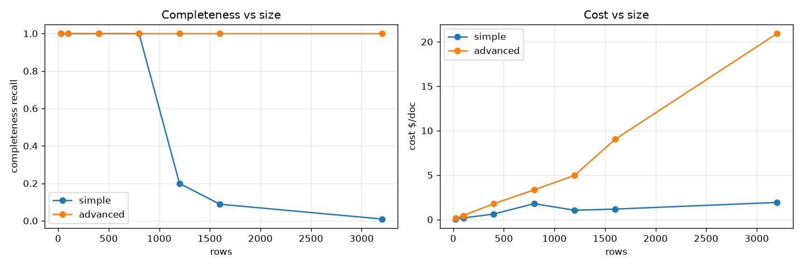

> **This is the evergreen "which configuration should I pick?" paper** — a cross-config
> comparison at the current release. For **release-over-release** comparisons (is the
> upgrade safe / cheaper / faster?), see the [Release Benchmark Audit Trail](releases/).

# GenAIIDP Configuration Guidance — Empirical Guidance for Document Extraction at Scale

**Release:** v0.6.5 · **Region:** us-west-2 · **Stack:** `IDPBench065`
**Models:** extraction Claude Sonnet 5 (the shipped default) · confidence Nova Lite ·
summarization disabled (unscored)
**Pricing:** `config_library/pricing.yaml` (sha256 `bc68d49e…`; rates as of 2026-08; intro
pricing may apply)

> Reproducible via the `benchmarks/` harness (run the `run-benchmarks` skill). Every number
> here is produced by `benchmarks/harness/aggregate.py` from live runs; none are recalled
> from memory. Supporting data: `benchmarks/results/v0.6.5-config-core/` (§2),
> `v0.6.5-config-scaling/` (§3), `v0.6.5-config-cost/` (§4),
> `v0.6.5-intconf-sonnet5/` + `v0.6.5-intconf-sonnet46/` (§2.1).

---

## Abstract

We benchmark the GenAI IDP accelerator across a controlled matrix of **configuration
options** (OCR backend, extraction mode, assessment mode, geometry, model, escalation) and
**document types and sizes** (synthetic documents with exact ground truth). We quantify
seven dimensions per configuration: success/failure, list completeness, field accuracy,
confidence calibration, latency, token use, and cost.

Headline results at v0.6.5:

1. **Extraction mode is primarily a cost/robustness decision, not an accuracy one, until
   documents get large.** On list documents up to **800 rows / 17 pages**, simple mode is
   complete (recall 1.000) and **~4× cheaper** than advanced (mean $0.476 vs $1.967 per
   document over 70 runs).
2. **Simple mode has a hard completeness cliff between 800 and 1,200 rows.** Recall is
   1.000 through 800 rows, then collapses: **0.199 @1,200 · 0.088 @1,600 · 0.009 @3,200** —
   and it is *silent* (status `COMPLETED`, valid-looking partial output, no error).
3. **Advanced (agentic) mode holds perfect completeness (recall 1.000) through 3,200 rows /
   66 pages**, at a steeply growing cost premium ($0.17 → $20.93 per document; **~11×
   simple** at 3,200 rows).
4. **🚨 Do not use `assessment: integrated` with simple extraction on list documents.** At
   the shipped default extraction model it returned **0 of 100 rows in 4 of 4 repeats**
   while reporting `COMPLETED` **and scalar accuracy 1.000**. Across the 7-document grid its
   mean recall is **0.294**, including an 800-row document that returned **zero** rows. This
   is the single most dangerous configuration in the matrix (§2.1).
5. **Advanced mode can null an entire list** on a long-free-text document (recall 0.000 on
   `longdesc_100` where simple mode got 1.000) — the agent's tool-decline path, unchanged
   since v0.6.0 (§2, finding 3).
6. **Scalar-field accuracy is 1.000 in every one of the 70 core runs**, and there were
   **0 failures**. Every completeness problem above is a *silent list* problem, invisible to
   field accuracy.

> **What changed between releases** is tracked separately in the
> [Release Audit Trail](releases/) — this paper focuses on *choosing a configuration at the
> current release*.

---

## 1. Methodology (summary)

See `benchmarks/matrices/METHODOLOGY.md` for the full protocol. In brief:
- **Synthetic corpus (exact GT):** generated bank statements whose every transaction row
  carries a unique `SEQnnnnn` tag, so completeness and accuracy are measured exactly, and
  size, row width, list count, text length and OCR noise are controlled variables.
- **Config matrix:** 10 curated *core* cells (the OCR × mode × assessment decision space),
  a two-cell scaling series, and a repeated-measures cost suite.
- **Scoring is resolver-free** (reads S3 + DynamoDB metering directly); costs priced from
  `pricing.yaml`; calibration from `explainability_info` confidence leaves.
- **Reference (real, labeled) corpora were not run for this release** — the numbers below
  are all synthetic-with-exact-ground-truth. The v0.6.0 edition of this paper additionally
  reported RealKIE-FCC ≈0.80 and OCR-Benchmark ≈0.87 weighted accuracy; those are **not**
  re-measured here and are omitted rather than carried forward.

### Configuration axes measured
| Axis | Values |
|------|--------|
| OCR | Textract LAYOUT, Textract TABLES, BDA, Bedrock-LLM |
| Extraction mode | simple (1 call) · advanced (agentic sharding + table tool) |
| Assessment | off · separate (Nova Lite pass) · integrated (inline) |
| Geometry | ocr_only (all cells below) |
| Extraction model | Sonnet 5 (all cells below; the shipped default) |
| Confidence model | Nova Lite (all cells below) |
| Reasoning effort | low (all cells below) |

The one-axis sweeps over geometry / escalation / extraction model / confidence model /
reasoning effort (the `full` suite) were **not** run for this release; §2–§4 vary OCR,
extraction mode and assessment only.

---

## 2. Configuration matrix (10 cells × 7 synthetic list docs, exact GT)

Mean over 7 bank-statement (transaction-list) documents spanning 5 → 800 rows and varying
row width, list count and description length (`tiny_form`, `small_narrow`, `med_narrow`,
`large_narrow`, `wide_400`, `manylists_400`, `longdesc_100`). `recall` = distinct
ground-truth rows recovered ÷ total (exact, via SEQ tags). **70 runs, 0 failures.**

| OCR / mode / assessment | recall | cost/doc | cost CV | mean conf | alert % | wall_s | fails |
|-------------------------|-------:|---------:|--------:|----------:|--------:|-------:|------:|
| Textract TABLES / simple / separate | 1.000 | $0.608 | 0.97 | 0.952 | 4.7 | 268 | 0 |
| Textract TABLES / simple / off | 1.000 | $0.457 | 0.78 | n/a | n/a | 108 | 0 |
| **🚨 Textract TABLES / simple / integrated** | **0.294** | $0.247 | 0.53 | 0.947 | 5.7 | 35 | 0 |
| Textract TABLES / advanced / separate | **0.857** | $1.904 | 1.05 | 0.977 | 1.8 | 252 | 0 |
| Textract TABLES / advanced / integrated | 1.000 | $2.436 | 0.96 | 0.944 | 5.7 | 410 | 0 |
| Textract LAYOUT / simple / separate | 1.000 | $0.514 | 1.02 | 0.996 | 0.0 | 266 | 0 |
| Textract LAYOUT / advanced / separate | 1.000 | $1.745 | 0.75 | 0.986 | 0.0 | 317 | 0 |
| BDA / simple / separate | 1.000 | $0.603 | 0.98 | 0.951 | 4.7 | 263 | 0 |
| BDA / advanced / separate | 1.000 | $1.784 | 0.66 | 0.983 | 0.1 | 290 | 0 |
| Bedrock-LLM / simple / separate | **0.860** | $0.430 | 0.82 | 0.951 | 4.7 | 388 | 0 |

`scalar_accuracy` is **1.000 for every cell and every document**, so it is not shown — and
that is itself the most important caveat in this table: **a cell that lost an entire
transaction list still scores perfect field accuracy.** Cost CV is high across the board
(0.53–1.05) because the 7 documents differ ~160× in row count; §4 measures cost variance
properly, with repeats on a single document.

**Findings**

1. **Simple mode is complete and cheapest at these sizes.** Every simple cell except
   `integrated` and Bedrock-LLM OCR is at recall 1.000 through 800 rows, for $0.43–0.61 per
   document, versus $1.74–2.44 for advanced. Simple is the right default up to the cliff in
   §3.
2. **🚨 Integrated confidence + simple extraction loses lists catastrophically (recall
   0.294).** Per document: 800 rows → **0 recovered**, 400 rows → 5–10 recovered,
   `longdesc_100` → 1 recovered; only the ≤100-row narrow documents survive. It is also the
   *cheapest* and *fastest* cell ($0.247, 35 s) — because it is doing far less work — which
   is exactly how it can look attractive. Corroborated with repeats in §2.1. Advanced +
   integrated recovers to 1.000 because sharding keeps each call small.
3. **⚠️ Advanced mode nulled an entire list** on `longdesc_100` (recall 0.000, 0/100 rows,
   $0.143 and 33 s — it gave up early), while simple mode returned all 100. That single
   document is the whole 0.857 for `tt-adv-sep`; the other six are 1.000. Same tool-decline
   failure path reported at v0.6.0, still open. BDA + advanced did **not** reproduce it this
   time (1.000 across all 7).
4. **LAYOUT-only is the cheapest complete option** (simple $0.514, advanced $1.745) and has
   the best-behaved confidence (mean 0.996, **0%** alert rate). Textract TABLES adds cost
   with no completeness benefit at this scale; enable TABLES for very large multi-page
   tables where it aids recovery, not by default.
5. **BDA is a fully viable OCR alternative** (simple $0.603 / advanced $1.784, both
   complete). **Bedrock-LLM is the cheapest ($0.430) but loses rows** on the larger
   documents — recall 0.403 on `wide_400` and 0.830 on `large_narrow` — and is slow
   (1,123 s on the 800-row document). Pick it for small documents and cost, not for
   completeness.
6. **Separate assessment is the safe confidence default.** It is dense (≈6,650 confidence
   leaves per cell across the grid), well-behaved, and costs ~$0.15/doc over `off`. Note
   `tt-simple-int` produced only **392** confidence leaves — another visible symptom of the
   missing rows.
7. **Advanced mode reports higher confidence and raises far fewer alerts** (`tt-adv-sep`
   0.977 / 1.8%, `bda-adv-sep` 0.983 / 0.1%) than the simple cells (≈0.95 / 4.7%), at
   equal (perfect) scalar accuracy on this corpus.

---

## 2.1 The `integrated` + simple hazard, with repeats

Because the failure is a *partial or empty list* rather than an error, a single run cannot
establish it. The `intconf` suite runs the integrated cell **and** a `separate` control on
the same document (`longdesc_100`, 100 rows) 4× each:

| extraction model | cell | recall per repeat | rows recovered | scalar accuracy |
|---|---|---|---|---|
| **Sonnet 5** (shipped default) | simple / **integrated** | 0.000, 0.000, 0.000, 0.000 | **0/100 ×4** | **1.000** |
| **Sonnet 5** | simple / separate | 1.000 ×4 | 100/100 ×4 | 1.000 |
| Sonnet 4.6 | simple / **integrated** | 0.100, 0.100, **1.000, 1.000** | 10/100, 10/100, 100/100, 100/100 | 0.500 |
| Sonnet 4.6 | simple / separate | 1.000 ×4 | 100/100 ×4 | 0.500 |

Two things to take from this:

- **At the shipped default model the failure is total and reproducible** — the entire
  transaction list is dropped, every time, and the document is reported `COMPLETED` with
  **perfect scalar accuracy**. Nothing in the run's status or field metrics reveals it.
- **At Sonnet 4.6 the same cell is bimodal (2 of 4 truncate to exactly 10 rows).** So any
  single-sample measurement of this cell — including the release audit trail's n=1 grid, see
  [releases/v0.6.5.md §3.1](releases/v0.6.5.md) — can land on either outcome and appear to
  show a fix. It is not fixed.

The `separate` control was complete in 8 of 8 runs across both models, at 1.5–2× the
integrated cell's cost. **Use `separate`.**

---

## 3. Scaling: where extraction hits limits (synthetic, exact GT)



Simple vs advanced, Textract TABLES + separate confidence, one transaction list of N rows
(~48 rows/page). All 14 runs returned `COMPLETED`.

| rows | pages | SIMPLE recall | simple $ | simple wall | ADVANCED recall | adv $ | adv wall |
|-----:|------:|--------------:|---------:|------------:|----------------:|------:|---------:|
| 25 | 1 | 1.000 | $0.055 | 52s | 1.000 | $0.166 | 48s |
| 100 | 3 | 1.000 | $0.169 | 73s | 1.000 | $0.438 | 177s |
| 400 | 9 | 1.000 | $0.614 | 290s | 1.000 | $1.777 | 389s |
| 800 | 17 | **1.000** | $1.782 | 602s | 1.000 | $3.335 | 407s |
| 1200 | 25 | **0.199** | $1.038 | 312s | 1.000 | $4.974 | 416s |
| 1600 | 33 | **0.088** | $1.169 | 389s | 1.000 | $9.026 | 584s |
| 3200 | 66 | **0.009** | $1.917 | 481s | 1.000 | $20.929 | 1120s |

### Simple mode: a silent completeness cliff between 800 and 1,200 rows

Recall is 1.000 through 800 rows (~17 pages), then collapses — 0.199 @1,200, 0.088 @1,600,
0.009 @3,200. The failure is **silent**: the run reports success and returns a
valid-looking but truncated list. Two properties make it worse than a simple token cap:

- **The recovered prefix *shrinks* as the document grows** — 239 rows recovered at 1,200,
  but only 141 at 1,600 and 30 at 3,200. The call abandons the list *earlier* on bigger
  input, so this is **not fixable by raising `max_tokens`**.
- **Cost goes down, not up, past the cliff** ($1.78 at 800 rows → $1.04 at 1,200). A
  truncated run is *cheaper*, so cost monitoring will not flag it either.

### Advanced mode: completeness holds; cost and wall-clock are the limits

Advanced (agentic sharding) holds **recall 1.000 through 3,200 rows / 66 pages** — sharding
keeps each call small, so neither the truncation nor an input-context limit is hit. The
practical limits are **cost** (up to ~$21/doc at 3,200 rows, ~11× simple) and **wall-clock**
(~19 min at 3,200 rows). Cost grows super-linearly in rows above ~800.

---

## 4. Cost: level AND variance (n=5 repeats, same 400-row doc)

Agentic-advanced cost is **high-variance run-to-run** (the agent's turn count is
non-deterministic), so a single sample cannot resolve a cost difference between configs. The
suite measures cost with repeats and reports mean ± stdev + coefficient of variation (CV); a
cost difference is only trustworthy when it exceeds the sampling spread.

Same document (`med_narrow`, 400 rows / 9 pages), 5 repeats per cell, 25 runs. All returned
`COMPLETED` with **recall 1.000 and scalar accuracy 1.000** — so these are like-for-like cost
comparisons of configurations that all did the job.

| config (OCR / mode / assessment) | cost mean ± stdev | CV | min–max | note |
|----------------------------------|-------------------|---:|---------|------|
| Textract TABLES / **simple** / separate | **$0.618 ± $0.006** | **0.9%** | $0.608–0.621 | deterministic |
| Textract LAYOUT / advanced / separate | $1.776 ± $0.121 | 6.8% | $1.677–1.944 | stable |
| BDA / advanced / separate | $1.835 ± $0.432 | 23.6% | $1.211–2.250 | moderate |
| Textract TABLES / advanced / integrated | $2.785 ± $1.131 | 40.6% | $1.879–4.665 | **high variance** |
| Textract TABLES / advanced / separate | $2.193 ± $1.504 | **68.6%** | $1.159–**4.723** | **high variance** |

**Findings**

- **Simple mode is ~2.9–4.5× cheaper than advanced *and* essentially deterministic** (cost CV
  0.9% vs 6.8–68.6%). For budgeting, simple is both cheaper and predictable; agentic cost must
  be planned as a *range*, not a point.
- **The worst case matters more than the mean.** `tt-adv-sep` ranged **$1.16 → $4.72 on the
  same document, same config** — a 4.1× spread. A capacity or cost model built on one sample
  of an agentic cell will be wrong.
- **LAYOUT / advanced is the cheapest and by far the most stable advanced option**
  ($1.776, CV 6.8%) — clean LAYOUT OCR lets the agent finish in fewer turns than TABLES or
  BDA, which is visible in the variance as well as the level.
- **Why advanced costs more even with the deterministic table tool:** advanced is a multi-turn
  agent loop, and each turn re-sends the growing conversation as *input* tokens. The residual
  premium is the irreducible multi-turn overhead, and its variance is inherent to the loop
  (the turn count is not deterministic).

> Methodology note: run these cells with `--suite cost` (or `--repeats ≥5`); the harness
> flags any cell with cost CV > 0.25 as unreliable-at-current-n, and
> `aggregate.py --compare` only reports a cost regression when the mean shift exceeds the
> combined sampling spread — so agentic noise never masquerades as a regression. That
> variance-aware treatment applies to **cost only**; recall/accuracy deltas are still
> compared per-sample, which is how a non-deterministic completeness swing can be reported
> as an improvement (see [releases/v0.6.5.md §4](releases/v0.6.5.md)).

---

## 5. Recommendations (customer guidance)

| Situation | Recommended configuration |
|-----------|---------------------------|
| Typical documents ≤ ~800 rows / ≤ ~17 pages | **simple mode** (complete, ~4× cheaper) |
| Table-free / forms corpora | **LAYOUT-only OCR** (cheapest complete option; best-behaved confidence) |
| Large multi-page tables (> ~800 rows) | **advanced mode** (guaranteed completeness through 3,200 rows; budget cost as a *range*) |
| Very large docs (> ~3,000 rows / 60 pages) | advanced **and split the document** if feasible (~$21 and ~19 min per document at 3,200 rows) |
| Documents with long free-text cells | **simple + separate**, not advanced — advanced nulled the whole list on `longdesc_100` (§2, finding 3) |
| Confidence needed | **`separate`** assessment. **Never `integrated` with simple extraction** (§2.1) |
| Cheapest OCR, small documents | Bedrock-LLM (**not** for >100-row lists — loses rows, §2 finding 5) |

**Safety notes — both failure modes are silent and both are invisible to field accuracy:**

1. Simple mode truncates large lists while reporting success, and a truncated run is
   *cheaper* than a complete one, so neither status nor cost will alert you. If large tables
   are possible, use advanced mode, or add a schema `minItems` constraint, or reconcile row
   counts downstream.
2. **`integrated` confidence with simple extraction returned 0 of 100 rows, 4 times out of
   4, at the shipped default model — with `scalar_accuracy` 1.000 and status `COMPLETED`.**

---

## 6. Product improvement backlog (surfaced by this study)

1. **🚨 Integrated confidence + simple extraction returns empty/partial lists (P0).** At the
   default extraction model this is a total loss of list data with no error and perfect
   scalar accuracy. Refuse the `integrated` + simple combination for list-bearing schemas
   (route to a separate confidence pass or sharded advanced), or fail the section loudly.
2. **Silent truncation needs detection, not just documentation (P0).** Both failure modes
   above return `COMPLETED`. Compare extracted row count against schema `minItems` (or an
   OCR-derived row estimate) and surface a completeness warning/metric. Note the recovered
   prefix *shrinks* with document size and cost *falls*, so no existing signal catches it.
3. **⚠️ Advanced list-null on long-free-text tables.** When the agent declines the table
   tool it can return the whole list as `null` (recall 0.000 on `longdesc_100`, and it
   finished in 33 s for $0.14 — visibly less work than a real extraction). Fall back to
   direct row extraction rather than nulling, and treat "list null but OCR shows a table" as
   an error.
4. **Variance-aware comparison for accuracy/recall, not just cost** — `--compare` currently
   promotes a single-sample recall swing to a headline improvement.
5. **`kv_form` doc-class benchmark** — add a flat key/value document class so non-list docs
   are scored against their own schema (currently excluded from the bank_statement matrix).
6. **Reference-corpus cells in the standard release run.** The `core` suite includes two
   20-document reference corpora, which makes it 470 document runs; that is why this edition
   uses the synthetic-only `coresynth` grid and reports no real-world accuracy number. A
   cheaper sampled variant would keep real-world accuracy in every release.

---

## Appendix A — Data & reproduction

- Per-(cell,doc) scores: `benchmarks/results/v0.6.5-config-core/summary.{json,csv}` (§2),
  `v0.6.5-config-scaling/` (§3), `v0.6.5-config-cost/` (§4),
  `v0.6.5-intconf-sonnet5/` and `v0.6.5-intconf-sonnet46/` (§2.1).
- Figures: `images/benchmark-scaling.png`
- Corpus manifest + generators: `benchmarks/corpus/` (regenerable; PDFs/configs gitignored)
- Matrices + methodology: `benchmarks/matrices/`
- Measured spend for this edition: **$75.08** (§2, 70 runs) + **$47.39** (§3, 14 runs) +
  **$46.03** (§4, 25 runs) + **$3.37** (§2.1, 16 runs) = **$171.87** over 125 document runs,
  priced from `pricing.yaml`.

```bash
source .venv/bin/activate && export PYTHONPATH=$PWD/lib/idp_common_pkg
python3 benchmarks/harness/gen_corpus.py

# §2 cross-config grid, §3 scaling, §4 cost variance — at the PRODUCT DEFAULT model
# (the committed default_cell holds extraction_model at the cross-version A/B control,
#  so a single-release study overrides it explicitly)
for s in coresynth scaling cost; do
  python3 benchmarks/harness/make_configs.py --suite $s --class bank_statement --set extraction_model=sonnet5
  AWS_PROFILE=default python3 benchmarks/harness/run_matrix.py --stack <STACK> --suite $s --native-upload --max-inflight 5
  AWS_PROFILE=default python3 benchmarks/harness/aggregate.py --run benchmarks/results/run-<stamp> --out benchmarks/results/v0.6.5-config-$s
done

# §2.1 the integrated-confidence hazard, with repeats + same-doc control
python3 benchmarks/harness/make_configs.py --suite intconf --class bank_statement --set extraction_model=sonnet5
AWS_PROFILE=default python3 benchmarks/harness/run_matrix.py --stack <STACK> --suite intconf --native-upload
```

**Honesty / limits.** Costs are estimates from `pricing.yaml` (rates as of 2026-08; intro
pricing may apply). §2 is one run per (cell, doc) — reliable for the *exact* completeness and
accuracy measures, not for per-cell cost, which is what §4 is for. No reference (real,
labeled) corpus and no one-axis sweeps (geometry, escalation, models, reasoning effort) were
run for this release; those sections are omitted rather than carried forward from v0.6.0.

---
> See the [Benchmarking Guide](./index.md) for how this suite is designed and run,
> the [Release Audit Trail](releases/) for release-over-release comparisons, and the
> [Extraction Scaling Guide](../extraction-scaling-guide.md) for size-based mode selection.
