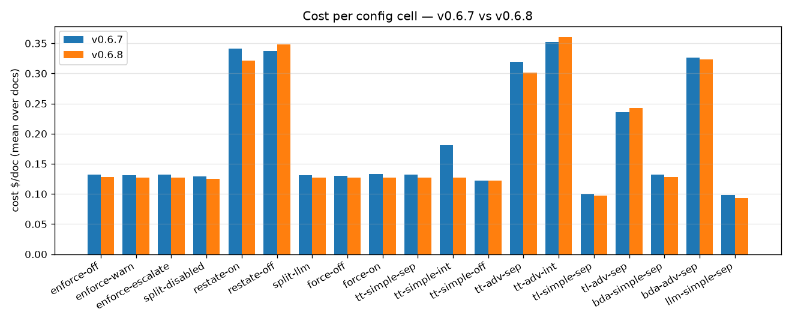
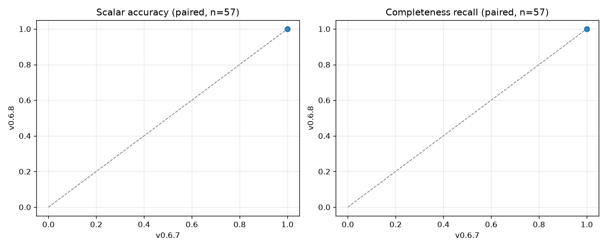

# v0.6.8 (published) vs v0.6.7 (published) — release benchmark audit

**Verdict: no regression. 171 of 171 `corefast` runs completed on each side, recall 1.000 and
per-row `cell_accuracy` 1.000 on every cell except the Bedrock-LLM OCR cell (0.889 → 0.944, within
spread), 0 cell-level regressions and 0 cell-level improvements from the gate, total grid cost
−3.2%, wall time −31% per run.** The one attributable cost change is assessment: **$1.12 → $0.70
across the grid (−37%)**, which is the Nova Lite confidence-loop fix (#861) that shipped in this
release, concentrated in the integrated-confidence simple cell (`core-tt-simple-int` $0.181 →
$0.127). `baseline.json` is promoted to this run.

This is the **release** entry: both sides are the **published** templates
(`idp-main_0.6.7.yaml`, `idp-main_0.6.8.yaml`), run the same night on the same account with
byte-identical configs. The prerelease audit of `v0.6.8.dev2` (2026-09-10) that previously occupied
this file is kept below as [§ Prerelease audit](#prerelease-audit-v068dev2-vs-v067-2026-09-10);
its scaling and sizer measurements were not repeated on the published build.

| | v0.6.7 (PREV) | v0.6.8 (NEW) |
|---|---|---|
| template | published `idp-main_0.6.7.yaml` | published `idp-main_0.6.8.yaml` |
| stack | `IDPBench067` — created fresh from the 0.6.7 template | `IDPUpg067to068` — created fresh from the **0.6.7** template, then `update-stack` to 0.6.8 (the customer upgrade path; see the [release-validation record](../../release-validation/v0.6.8.md)) |
| suite | `corefast` (19 cells × 3 docs × 3 repeats) | same, identical config files (`--native-upload`) |
| runs / failures | 171 / 0 | **171 / 0** |
| launched | 2026-09-12 00:10 UTC | 2026-09-12 00:10 UTC (concurrently) |
| region | us-west-2 | us-west-2 |
| commit recorded in `meta.json` | — | `d584958e0` (tag `v0.6.8` = `267de2868`; the two differ only in docs) |

### Deviation from the standard procedure — read before citing a delta

The standard procedure runs both sides on **one** stack (PREV, then upgrade in place, then NEW).
Here the two sides ran on **two stacks at once**. Both stacks were created minutes apart from the
same published 0.6.7 template with the same single parameter (`AdminEmail`); the NEW stack is that
0.6.7 stack after the in-place upgrade to published 0.6.8, which is exactly what the one-stack
procedure produces — the difference is only that the PREV grid ran on a *sibling* of that stack
rather than on it before the upgrade. The reason was time: the account was at its IAM role quota
(release-validation Finding 1), and running the two grids concurrently on two stacks saved about
two hours. Wall-time deltas below should be read with this in mind (two stacks, one night, same
`--max-inflight 6`); cost, recall and accuracy do not depend on which stack ran them.

## The comparison

Same configs, same documents, same night — only the code version differs. `longdesc_100` is the
**post-#781** corpus document on both sides, so unlike the prerelease audit nothing is excluded.

| cell | runs / fail (0.6.7 → 0.6.8) | recall | cell accuracy | cost / run (mean over 3 docs) | wall / run |
|---|---|---|---|---|---|
| `core-bda-adv-sep` | 9/0 → 9/0 | 1.000 → 1.000 | 1.000 → 1.000 | $0.327 → $0.324 (-1%) | 162 s → 118 s (-27%) |
| `core-bda-simple-sep` | 9/0 → 9/0 | 1.000 → 1.000 | 1.000 → 1.000 | $0.133 → $0.128 (-4%) | 110 s → 64 s (-42%) |
| `core-llm-simple-sep` | 9/0 → 9/0 | 1.000 → 1.000 | 0.889 → 0.944 | $0.098 → $0.093 (-5%) | 98 s → 54 s (-44%) |
| `core-tl-adv-sep` | 9/0 → 9/0 | 1.000 → 1.000 | 1.000 → 1.000 | $0.236 → $0.243 (+3%) | 139 s → 119 s (-14%) |
| `core-tl-simple-sep` | 9/0 → 9/0 | 1.000 → 1.000 | 1.000 → 1.000 | $0.100 → $0.097 (-3%) | 98 s → 65 s (-34%) |
| `core-tt-adv-int` | 9/0 → 9/0 | 1.000 → 1.000 | 1.000 → 1.000 | $0.353 → $0.360 (+2%) | 113 s → 108 s (-5%) |
| `core-tt-adv-sep` | 9/0 → 9/0 | 1.000 → 1.000 | 1.000 → 1.000 | $0.319 → $0.301 (-6%) | 152 s → 106 s (-30%) |
| `core-tt-simple-int` | 9/0 → 9/0 | 1.000 → 1.000 | 1.000 → 1.000 | **$0.181 → $0.127 (-30%)** | 68 s → 64 s (-6%) |
| `core-tt-simple-off` | 9/0 → 9/0 | 1.000 → 1.000 | 1.000 → 1.000 | $0.122 → $0.122 (+0%) | 37 s → 37 s (+1%) |
| `core-tt-simple-sep` | 9/0 → 9/0 | 1.000 → 1.000 | 1.000 → 1.000 | $0.132 → $0.127 (-4%) | 111 s → 64 s (-42%) |
| `enforce-escalate` | 9/0 → 9/0 | 1.000 → 1.000 | 1.000 → 1.000 | $0.132 → $0.127 (-4%) | 109 s → 64 s (-41%) |
| `enforce-off` | 9/0 → 9/0 | 1.000 → 1.000 | 1.000 → 1.000 | $0.132 → $0.128 (-3%) | 143 s → 73 s (-49%) |
| `enforce-warn` | 9/0 → 9/0 | 1.000 → 1.000 | 1.000 → 1.000 | $0.131 → $0.127 (-3%) | 104 s → 65 s (-37%) |
| `force-off` | 9/0 → 9/0 | 1.000 → 1.000 | 1.000 → 1.000 | $0.131 → $0.127 (-2%) | 98 s → 66 s (-33%) |
| `force-on` | 9/0 → 9/0 | 1.000 → 1.000 | 1.000 → 1.000 | $0.133 → $0.127 (-5%) | 110 s → 65 s (-41%) |
| `restate-off` | 9/0 → 9/0 | 1.000 → 1.000 | 1.000 → 1.000 | $0.337 → $0.348 (+3%) | 162 s → 130 s (-20%) |
| `restate-on` | 9/0 → 9/0 | 1.000 → 1.000 | 1.000 → 1.000 | $0.341 → $0.321 (-6%) | 161 s → 118 s (-27%) |
| `split-disabled` | 9/0 → 9/0 | 1.000 → 1.000 | 1.000 → 1.000 | $0.129 → $0.125 (-3%) | 101 s → 63 s (-38%) |
| `split-llm` | 9/0 → 9/0 | 1.000 → 1.000 | 1.000 → 1.000 | $0.131 → $0.128 (-3%) | 104 s → 64 s (-38%) |

Completeness is exact on both sides: **11,685 of 11,685 truth rows extracted, 23,370 cells
compared**, so the 1.000 recall is a full-row count, not a null column scoring itself correct
(see the benchmark metric caveats in `index.md`). Mean confidence 0.993 → 0.993; no cell below 0.9
on either side.

### Gate output (`aggregate.py --compare`, thresholds: accuracy −0.02, cost +15%, any new failure)

```
=== REGRESSIONS (0) ===          === IMPROVEMENTS (0) ===
=== CELL-LEVEL REGRESSIONS (0) ===   === CELL-LEVEL IMPROVEMENTS (0) ===
=== INCONCLUSIVE (large % but within sampling noise) (2) ===
  core-tt-simple-int: cost -30% (0.181±0.106 n9 -> 0.127±0.079 n9)
  core-llm-simple-sep: acc +0.056 (0.889->0.944); paired per-doc deltas n=9 spread±0.167
```

Four per-document rows are also flagged inconclusive (three `tiny_form` cost rows at +28–34% on
cells whose per-run cost is $0.03–0.05, and one `small_narrow` accuracy row on the Bedrock-LLM OCR
cell); all are inside their run-to-run spread at n=3.

### Where the money and time went

| phase | v0.6.7 total (171 runs) | v0.6.8 total | Δ |
|---|---|---|---|
| OCR | $6.06 | $6.06 | 0 |
| Classification | $0.37 | $0.37 | 0 |
| Extraction | $24.82 | $24.21 | −2.5% |
| **Assessment** | **$1.12** | **$0.70** | **−37%** |
| grid total | $32.38 | $31.34 | −3.2% |

- **Assessment −37%** is the release's one attributable cost change. v0.6.8 caps the Nova Lite
  confidence batch and gives it its own token budget (#861), removing the temperature-0 repetition
  loop that made one confidence call per 100-row section overrun. It lands almost entirely on the
  integrated-confidence simple cell (`core-tt-simple-int`, −30%), where the confidence pass is
  inside the extraction call; the `separate`-assessment cells move −2 to −6%.
- **Extraction −2.5% and wall time −31%** are consistent across the simple cells (−33 to −49% wall)
  and smaller on advanced (−5 to −30%). The wall-time figure is the least controlled number here
  (two stacks, see the deviation note) — read it as "not slower", not as a measured speed-up.
- Per document: `tiny_form` $0.036 → $0.038 (+5%), `small_narrow` $0.221 → $0.207 (−6%),
  `longdesc_100` $0.311 → $0.304 (−2%).

### What this A/B does *not* show — and why the prerelease audit looked different

Both sides run **byte-identical configs built from the current repo's defaults**, so a change that
ships as *configuration* is present on both sides and cancels out. The #726 over-splitting fix is
one of those: it is the TABLE CONTINUATION rule in the default classification prompt (#817), and
with that prompt every document is **one section on v0.6.7 code too** (sections/doc 1.00 on both
sides here). That is why the prerelease audit — which compared against the *committed* v0.6.7
result set, run in September with the v0.6.7-era prompt — showed sections 1.5–3 → 1.0 and
Bedrock-LLM OCR recall 0.410 → 1.000, while this same-night A/B shows 1.000 → 1.000 on both.
Neither is wrong: this entry isolates the **code** delta; the release as a customer receives it
(code **and** default config) is the prerelease comparison plus the corpus change it had to exclude.

For reference, the gate against the committed v0.6.7 set (`benchmarks/results/v0.6.7/corefast/`,
stack `IDP1`, 2026-09-04) reports: 8 "regressions", all `longdesc_100` cost +22–26% — the #781
corpus change (a different, readable document), not code; 3 "improvements", all the `force-on`
cell going from 3/3 failures to 0/3 — the `$id` tool-schema defect fixed by #744, which that
September run happened to catch mid-fix; and 10 inconclusive cost drops of −25 to −47% on the
advanced and escalation cells, which is over-splitting no longer multiplying agentic calls. None
of those three effects appears in the same-night A/B above, because all three are corpus, config
or already-on-both-sides.

## Not done here

- No document above 100 rows, and no reference corpus: `corefast` only. The prerelease audit's
  simple-mode scaling (800 rows → 43, `COMPLETED`, no issue) and confidence-sizer measurements
  below were made on `v0.6.8.dev2` and were not repeated on the published build; nothing in this
  grid touches them.
- No advanced-mode scaling re-run.
- One night, two stacks — see the deviation note. Repeat-count is the standard 3 per cell×doc.

## Reproducing

```bash
python3 benchmarks/harness/gen_corpus.py
python3 benchmarks/harness/make_configs.py --suite corefast --class bank_statement
# PREV: a fresh stack from the published 0.6.7 template; NEW: the same, update-stack'd to 0.6.8
AWS_PROFILE=default python3 benchmarks/harness/run_matrix.py --stack IDPBench067    --suite corefast --native-upload --max-inflight 6
AWS_PROFILE=default python3 benchmarks/harness/run_matrix.py --stack IDPUpg067to068 --suite corefast --native-upload --max-inflight 6
python3 benchmarks/harness/aggregate.py --run benchmarks/results/run-<prev-stamp> --out <scratch>/prev-067-corefast
python3 benchmarks/harness/aggregate.py --run benchmarks/results/run-<new-stamp>  --out benchmarks/results/v0.6.8/corefast
python3 benchmarks/harness/aggregate.py --compare benchmarks/results/v0.6.8/corefast/summary.json --baseline <scratch>/prev-067-corefast/summary.json
python3 benchmarks/harness/aggregate.py --figures-compare benchmarks/results/v0.6.8/corefast/summary.json <scratch>/prev-067-corefast/summary.json --labels v0.6.8 v0.6.7
cp benchmarks/results/v0.6.8/corefast/summary.json benchmarks/results/baseline.json
```

The PREV re-run is not committed (one result set per release — the committed v0.6.7 set is the
v0.6.7 release entry); its per-cell numbers are the left-hand column of the table above.




---

## Prerelease audit: v0.6.8.dev2 vs v0.6.7 (2026-09-10)

> Retained verbatim from the prerelease entry (PR #842). Its baseline is the **committed**
> v0.6.7 result set, not a same-night re-run, so its deltas include the default-config and corpus
> changes discussed above.

**Verdict: no accuracy or completeness regression; over-splitting is gone; one measured
behaviour change to decide on before release.** 171 of 171 `corefast` runs completed,
recall 1.000 and per-row `cell_accuracy` 1.000 on every one of the 19 cells, and every
document is now **one section** (v0.6.7 produced 2–3 from #726). The in-place upgrade
v0.6.7 → this build reached `UPDATE_COMPLETE` with the default config rewritten and the
sample lending package processing identically. The change to decide on: with over-splitting
fixed, **simple mode's single-response limit is exposed again** — complete at 400 rows,
43 of 800 rows at 17 pages with `COMPLETED` and no processing issue, hard failure from ~25
pages (measured 2026-09-10; §3 of the guidance paper). That is the accepted consequence of
not giving simple mode shard-and-rejoin; the follow-up is a warning, not a mode switch.

| | baseline | this build |
|---|---|---|
| version | v0.6.7 | v0.6.8.dev2 (develop `1b8386b8b`) |
| stack | `IDPRel066` (upgraded) | `IDPRel068` (fresh) |
| suite | `corefast` (19 × 3 × 3) | `corefast` (19 × 3 × 3) |
| runs / failures | 171 / 0 | **171 / 0** |
| region | us-west-2 | us-west-2 |

### The comparison

`longdesc_100` is **excluded from the deltas**: the #781 corpus fix stopped its long
descriptions overprinting the Amount column, so it is a different document (4 pages, a
readable column — its v0.6.7 mean confidence was 0.664 with a third of cells below 0.9;
now 0.997). Its "+26–37% cost" and "+0.5 scalar accuracy" rows in the gate output are the
document change, not the code. On the two unchanged documents:

| cell | recall v0.6.7 → now | scalar acc | cost/doc |
|---|---|---|---|
| `core-bda-adv-sep` | 1.000 → 1.000 | 1.000 → 1.000 | $0.191 → $0.220 (+15%) |
| `core-bda-simple-sep` | 1.000 → 1.000 | 1.000 → 1.000 | $0.086 → $0.092 (+7%) |
| `core-llm-simple-sep` | 0.410 → 1.000 | 1.000 → 0.917 | $0.063 → $0.065 (+3%) |
| `core-tl-adv-sep` | 1.000 → 1.000 | 1.000 → 1.000 | $0.151 → $0.153 (+1%) |
| `core-tl-simple-sep` | 1.000 → 1.000 | 1.000 → 1.000 | $0.063 → $0.067 (+7%) |
| `core-tt-adv-int` | 1.000 → 1.000 | 1.000 → 1.000 | $0.248 → $0.246 (-1%) |
| `core-tt-adv-sep` | 1.000 → 1.000 | 1.000 → 1.000 | $0.191 → $0.226 (+18%) |
| `core-tt-simple-int` | 1.000 → 1.000 | 1.000 → 1.000 | $0.130 → $0.088 (-32%) |
| `core-tt-simple-off` | 1.000 → 1.000 | 1.000 → 1.000 | $0.082 → $0.084 (+2%) |
| `core-tt-simple-sep` | 1.000 → 1.000 | 1.000 → 1.000 | $0.089 → $0.091 (+2%) |

Every cost delta is inside its cell's run-to-run spread at n=6 (the gate marks all of them
inconclusive); the sign is mixed. `core-llm-simple-sep` (Bedrock-LLM OCR) is the one real
improvement: recall 0.564 → 1.000 across all three documents (tiny_form 0.20 → 1.00,
small_narrow 0.62 → 1.00), while its scalar accuracy dipped 1.000 → 0.944 on one
document, within spread.

#### Sections: the #726 fix, measured in the release grid

Mean sections per document across the 19 cells: **1.00** on every cell (v0.6.7: 2–3 on the
same documents, up to 17 across the 9 documents of a cell). The same-stack A/B that settled
this is in the guidance paper (§7, `boundaryab`: 1/5 → 5/5 on the unpaginated statement).

#### Measurements run on this build (details in `config-guidance.md`)

- **Simple-mode scaling** (Sonnet 5, §3): 25/100/400 rows complete as one section; **800 rows
  → 43 rows, COMPLETED, no issue**; 1,200+ rows FAIL (`Input is too long`). v0.6.7 scored
  1.000 on all of these via over-splitting.
- **Confidence batch sizing** (§7): shipped sizing pays one truncated Nova Lite call per
  100-row section; a pinned batch of 8 removed every truncation at **−29% assessment cost,
  −38 s/document**, identical results (5 repeats/arm, warm).
- **Upgrade test**: v0.6.7 → this build, `UPDATE_COMPLETE`, `Config#default` revision 2,
  post-upgrade smoke 3/3 with identical sections. Two Payslip fields null after upgrade
  turned out to be Sonnet 5 variance present at v0.6.7 too (1 correct in 11 attempts across
  both code versions) — filed as #839.

### Not done in the prerelease audit

- No advanced-mode scaling re-run (advanced shards regardless; 1.000 through 3,200 at v0.6.7).
- `baseline.json` was not promoted from the prerelease build; it is promoted from the published
  run above.

### Reproducing the prerelease measurements

```bash
python3 benchmarks/harness/gen_corpus.py --only tiny_form,small_narrow,longdesc_100
python3 benchmarks/harness/make_configs.py --suite corefast --class bank_statement
AWS_PROFILE=default python3 benchmarks/harness/run_matrix.py --stack <S> --suite corefast
# sizer A/B: --suite sizerab [--set conf_batch=b8|b13]; scaling: --suite scalingsimple --set extraction_model=sonnet5
```
