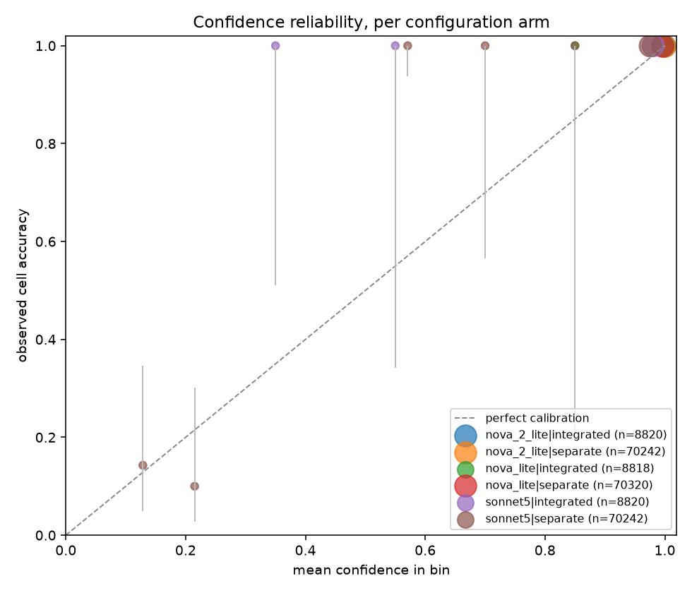

<!-- Copyright Amazon.com, Inc. or its affiliates. All Rights Reserved. -->
<!-- SPDX-License-Identifier: MIT-0 -->

# Confidence calibration on exact ground truth — 466,000 cells, and the default grader cannot rank errors

> **Why this page exists.** Every extracted field carries a confidence score, and the
> product's review-effort estimator turns those scores into "review the worst *N*
> documents and you reach 99% accuracy". That promise needs two separate properties
> from the score, and only one of them had ever been measured here. **Calibration**
> asks whether 0.9 really means 90%. **Discrimination** asks whether the wrong cells
> are the low-scoring ones — and discrimination is the only property worst-first
> review actually depends on. This page measures both, against exact per-cell ground
> truth, for each shipped confidence mode and grader model. The short answer is that
> the shipped default (`separate` mode on Nova Lite) is **well calibrated and
> undiscriminating**: it places essentially every cell in one confidence bin, so it is
> nearly always right about the population and carries no information about which
> individual cells to look at.

**What made this measurable.** Nothing in the harness could join a confidence score
to the cell it described: the traversal collected the bare scalar and discarded the
field path, so the only available statistics were distributional — mean confidence,
percentage below a threshold, leaf count. None of those can be wrong about a
confidence score, because none of them compares it to anything. The scorer now walks
`explainability_info` with `idp_common.evaluation.flatten_confidences`, which is the
same field-path rule the product keys its stored confidence curves by, and joins each
path to the synthetic corpus's per-cell truth through the unique `SEQnnnnn` row tag
([#935](https://github.com/aws-solutions-library-samples/accelerated-intelligent-document-processing-on-aws/issues/935)).

**Method.** Retroactive re-scoring: the confidence values and the extracted cells are
both already in the output bucket from the original runs, so this study reads S3 and
spends nothing on inference. Stack `IDPUpg067to068`, `us-west-2`, code version
`v0.6.8`, runs from 2026-09-12 → 09-15, re-scored 2026-09-21; the replication set is
stack `IDP1`, code version `v0.6.9`, runs from 2026-09-19. Seven synthetic
bank-statement documents (`tiny_form`, `small_narrow`, `med_narrow`, `large_narrow`,
`longdesc_100`, `wide_400`, `manylists_400`) with exact typed truth for the `Date` and
`Amount` cell of every tagged transaction row. Extraction, OCR and geometry are held
fixed across the grader arms; the only axis that moves is named in each table.

Statistics come from the shipped engine, not from a local reimplementation.
`idp_common.evaluation.confidence_curve.ConfidenceCurve` supplies the calibration
error, the binned AUROC and the reliability verdict, so the numbers are statements
about the bars the product itself acts on: `ECE_UNRELIABLE_THRESHOLD = 0.15`,
`AUROC_UNRELIABLE_THRESHOLD = 0.55`, `MIN_OBSERVATIONS_FOR_MEASURED = 30`,
`MIN_OBSERVATIONS_FOR_AUROC = 100`, `MIN_BINS_FOR_SIGNAL = 3`. The unbinned AUROC and
the Brier score come from Stickler's `AUROCMetric` and `BrierScoreMetric`, which are
the same metric classes the evaluation service passes to `compare_with`.

---

## 1. The headline: same extraction, same error count, opposite verdicts

The cleanest contrast in the grid is a single-axis one. Two arms differ in exactly the
confidence model and nothing else — same extraction model (Sonnet 4.6), same
classifier, same OCR, same seven documents, same 70,242 scored cells:

| Confidence grader | Cells | Wrong cells | ECE (mean-conf) | Brier | AUROC (binned) | AUROC (unbinned) | Populated bins | Shipped verdict |
|---|---:|---:|---:|---:|---:|---:|---:|---|
| `nova_2_lite` | 70,242 | 64 | 0.0005 | 0.0009 | 0.500 | **0.465** | 1 | degenerate, undiscriminating |
| `sonnet5` | 70,242 | 66 | 0.0244 | 0.0014 | 0.772 | **0.859** | 6 | reliable |

Extraction quality is indistinguishable between the two — accuracy 0.9991 with a 95%
Wilson interval of [0.9988, 0.9993] on both sides, 64 versus 66 wrong cells out of the
same 70,242. So the difference in the right-hand columns is the grader and cannot be
anything else.

The shipped default grader, Nova Lite, behaves like `nova_2_lite` rather than like
`sonnet5`:

| Confidence grader | Mode | Cells | Wrong cells | ECE (mean-conf) | AUROC (unbinned) | Bins | Verdict |
|---|---|---:|---:|---:|---:|---:|---|
| `nova_lite` (**shipped default**) | `separate` | 70,320 | 55 | 0.0037 | **0.417** | 1 | degenerate, undiscriminating |
| `nova_2_lite` | `separate` | 70,242 | 64 | 0.0005 | 0.465 | 1 | degenerate, undiscriminating |
| `sonnet5` | `separate` | 70,242 | 66 | 0.0244 | 0.859 | 6 | reliable |
| `nova_lite` (**shipped default**) | `integrated` | 8,818 | 0 | 0.0031 | — | 2 | degenerate |
| `nova_2_lite` | `integrated` | 8,820 | 0 | 0.0007 | — | 1 | degenerate |
| `sonnet5` | `integrated` | 8,820 | 0 | 0.0197 | — | 3 | reliable |

The `nova_lite` arm carries one confound worth naming: the only v0.6.8 grid cell with
`confidence_model: nova_lite` and extraction on Sonnet 4.6 came from the suite that
overrides the **classification** model to Sonnet 5, while the other two arms ran the
`coresynth` default classifier. On a single-class synthetic corpus the classifier does
not touch the extracted cell values, and the data agrees: the arm scores 70,320 cells
at accuracy 0.9992 [0.9990, 0.9994] against 70,242 at 0.9991 [0.9988, 0.9993], which
is the same extraction to within the interval. The `nova_2_lite`-versus-`sonnet5` pair
above has no confound at all and shows the same split, which is why it is the headline.



Read the diagram by marker position, not by marker count. Every Nova arm is one
enormous marker at (≈1.0, ≈1.0): all of its mass sits in the top bin, at a mean
confidence of 0.995 and an observed accuracy of 0.999. The Sonnet 5 arm has the same
dominant top-bin marker *and* two small markers near the bottom-left of the diagonal,
at mean confidence 0.129 and 0.215 with observed accuracy 0.143 and 0.100. Those two
bins hold 41 cells, 36 of which are wrong — over half of the arm's 66 errors, sitting
where a worst-first queue reaches them first.

---

## 2. Why a passing ECE says nothing here

Every arm in the grid passes calibration. The largest mean-confidence ECE anywhere
above is 0.0244, against a gate that fires at 0.15. Two of the arms also pass with a
gross defect present, which is the point:

| Arm | Cells | Wrong cells | Accuracy [95% Wilson] | Mean confidence | ECE (mean-conf) | AUROC (unbinned) |
|---|---:|---:|---|---:|---:|---:|
| `separate` / `nova_lite` / extraction `astra` | 54,484 | **1,413** | 0.9741 [0.9727, 0.9754] | 0.9952 | 0.0211 | 0.520 |
| `separate` / `nova_lite` / extraction `nova_lite` | 11,462 | **2,875** | 0.7492 [0.7412, 0.7570] | 0.9933 | 0.2441 | 0.541 |

The first row is the failure this whole exercise was built to find. 1,413 cells are
wrong; the grader asserted a mean confidence of 0.9952 over all 54,484 of them; every
single cell landed in the top bin; and the calibration error is 0.0211 — comfortably
inside the reliability bar. A release validated on ECE alone would have shipped that.
Discrimination is 0.520, which is chance.

The second row is the one calibration *does* catch: at 25% of cells wrong and a mean
confidence still above 0.99, the mean-confidence ECE reaches 0.2441 and the shipped
`overconfident` flag fires. So the ECE gate is not useless — it detects gross
overconfidence. What it cannot detect is a 2.6%-wrong extraction described at 99.5%
confidence, and 2.6% wrong is the regime a real deployment lives in.

⚠️ That second row is also the thinnest arm in the grid: **58** of its 112 runs
completed with joinable confidence, over **6** documents rather than 7. Read it as
directional — see §6, which gives every arm's own run, document and excluded-run count.
The first row (102 of 112 runs, 7 documents) and the three headline arms in §1 (112 of
112, nothing excluded) do not carry that caveat.

**Two ECE estimators, and the difference matters.** The shipped
`CalibrationHealth.ece` compares each bin's accuracy to the bin **midpoint**, because
the curve stores counts rather than the confidences themselves. That puts a floor
under it: a set of cells all scored 1.00 and all correct is perfectly calibrated and
still reports 0.05, the distance from 1.00 to the top bin's midpoint of 0.95. That is
well inside the 0.15 bar so the gate does not misfire, but 0.05 is not the grader's
calibration error and must not be quoted as one. Every ECE in this page's tables is
the mean-confidence estimator, which is what Stickler's `ECEMetric` computes and what
the reliability diagram plots. The harness records both, as
`calibration_ece` (the gate's) and `calibration_ece_mean_conf`.

---

## 3. The verdict that does not depend on a statistical estimate

`bin_coverage` is the column to trust most, because it is a structural fact rather
than an estimate. `MIN_BINS_FOR_SIGNAL` is 3: a confidence score occupying fewer than
three of the ten 0.1-wide bins cannot order a review queue, because almost every cell
ties with almost every other one. Both Nova graders put **all** 70,000-odd cells in a
single bin. No amount of additional data changes that reading, and it is what makes
the `degenerate` flag fire ahead of any AUROC question.

That matters because the AUROC estimates themselves are imprecise, and the cell count
is the wrong number to judge their precision by. AUROC is estimated over
wrong × correct pairs, so the binding sample size is the **wrong**-cell count: 55, 64
and 66 in the three headline arms. An arm with 70,320 cells and 55 errors is a
55-observation measurement of ranking power however large the cell count looks — which
is why the harness prints the error count next to the AUROC columns.

**No interval is reported for AUROC, deliberately.** The Wilson intervals on this page
are on genuine binomial proportions — overall accuracy, and each reliability bin's
accuracy — computed with `idp_common.evaluation.wilson_interval`. AUROC is a
proportion of *pairs*, and the pairs are not independent (each cell appears in many of
them), so a Wilson interval on it would be wrong in a direction that flatters it. The
honest statements are therefore: the Nova arms' point estimates (0.417, 0.465, 0.520,
0.541) are **indistinguishable from chance on 55–1,413 errors**, and the reading "very
slightly worse than chance" is not supported — the shipped gate's threshold-crossing
verdict rests on the single-bin structure, not on the sign of the deviation. The
Sonnet 5 arm's 0.859 on 66 errors is far enough from 0.55 that the direction is not in
doubt, though the second decimal place is.

---

## 4. What `integrated` mode could not be measured on

Six of the seven `integrated`-mode arms returned **zero** wrong cells: 8,814 to 8,820
cells per arm, all correct. Discrimination is undefined when one class is absent — there
are no wrong cells to rank — so those rows report `—` rather than a number, and reading
the absence as a good result would be exactly backwards.

The seventh is the arm where extraction itself was Nova Lite, and it is a different
animal: 998 cells over 6 documents and 5 of the 14 runs, with 318 wrong cells, a
mean-confidence ECE of 0.310 and both `overconfident` and `undiscriminating` set. It is
not a measurement of `integrated` mode so much as of a broken extraction, and with 8 of
its 14 runs excluded it is the thinnest arm in the grid. Nothing here rests on it.

State the power floor rather than the null. With 0 errors observed in 8,820 cells, the
95% Wilson interval on accuracy is [0.999565, 1.0], so the true cell-error rate could
be as high as **1 in 2,297** and still produce this observation. At that rate the
7-document, 14-run `integrated` grid would be expected to yield **3.84** errors —
against `MIN_OBSERVATIONS_FOR_AUROC` of 100. So `integrated` mode's ranking power is
**unknown on this corpus**, and it is unknown for a sample-size reason that more
repeats of these documents would fix only slowly: reaching 100 errors at the upper
bound of the error rate would take roughly 230,000 cells, about 26 times this grid. The
one thing that *is* measured for it is bin coverage, and it splits the same way as
`separate`: 1 to 2 bins on the Nova graders, 3 on Sonnet 5.

The arms are also not equally powered against each other: `separate` ran 112 runs per
arm and `integrated` 14, because the `coresynth` grid allocates them that way. No
`separate`-versus-`integrated` comparison on this page should be read as a controlled
one.

---

## 5. Replication

The v0.6.9 grid, on a different stack (`IDP1`) and a different code version, was
re-scored the same way. The `sonnet5` grader was not in that grid, so the positive
result rests on **one** release; the negative result reproduces to three decimal
places:

| Arm | v0.6.8 cells / errors / AUROCu / bins | v0.6.9 cells / errors / AUROCu / bins |
|---|---|---|
| `separate` / `nova_lite` / `sonnet46` | 70,320 / 55 / 0.417 / 1 | 70,320 / 57 / 0.419 / 1 |
| `separate` / `nova_lite` / `sonnet5` | 65,864 / 43 / 0.382 / 1 | 64,342 / 58 / 0.428 / 1 |
| `separate` / `nova_2_lite` / `sonnet46` | 70,242 / 64 / 0.465 / 1 | 70,260 / 68 / 0.465 / 1 |
| `separate` / `nova_lite` / `astra` | 54,484 / 1,413 / 0.520 / 1 | 70,542 / 1,806 / 0.557 / 1 |
| `separate` / `sonnet5` / `sonnet46` | 70,242 / 66 / 0.859 / 6 | not run |

---

## 6. What this does and does not license

**Which shipped configuration can support worst-first human review.** On this corpus,
only `confidence.model: us.anthropic.claude-sonnet-5` can. The shipped default,
`separate` mode on `us.amazon.nova-lite-v1:0`, cannot: it is degenerate by bin
coverage and undiscriminating by AUROC, in two releases on two stacks. A review queue
ordered by its scores is ordered arbitrarily, and the review-effort estimator's
`recommendReviewAll` is the correct output for it — which is what the shipped estimator
already returns, because `calibration_health()` sets both flags.

One arm needs the clause spelled out: the `astra`-extraction arm's unbinned AUROC is
0.520 in v0.6.8 and **0.557 in v0.6.9**, and the second of those is fractionally
*above* `AUROC_UNRELIABLE_THRESHOLD` (0.55). It does not join Sonnet 5 on the usable
side of this conclusion, and the reason is the argument in §3 rather than the AUROC
figure: that arm's 70,542 cells occupy **one** bin, so it is `degenerate` and its
ordering is arbitrary whatever the ranking statistic reads. Two releases straddling a
threshold by 0.007 on an estimate this imprecise is also exactly the situation in which
a point estimate should not decide anything.

**This is not a recommendation to change the default.** The default is a cost
decision, and the cost gap is large: `base-confidence.yaml` records a live A/B at
~$0.0011 per document on Nova Lite against ~$0.145 on Sonnet 5, about 130×. Nothing
measured here disturbs that number. What the page changes is the *basis* on which the
trade-off is made — the comment justifying Nova Lite spoke only to cost, and the
calibration half of the trade was assumed rather than measured. Deployments that use
confidence as an **alerting** signal against a threshold are largely unaffected: the
scores are well calibrated, and a threshold on a population that is 99.9% correct
behaves as advertised. Deployments that use confidence to **rank** a review queue
should either move the grader to Sonnet 5 for that workload, or treat the queue as
unordered and size review by the audit sample instead.

**What this corpus cannot tell you.** Three limits, in order of how much they bind.

**1. The cells are not independent, and the mechanism is mechanical duplication rather
than correlation.** `reconcile_assessment_to_data`'s `_expand_row_to_per_column` fans
**one** per-row confidence out across every populated scalar column of that row, so a
row's cells frequently carry the *identical* value by construction. Measured in
`separate`/`nova_lite` on `wide_400`: 396 to 400 of the 400 rows have every column
carrying the same confidence, and the whole 1,200-leaf document contains only **2**
distinct confidence values — 2 to 10 across sampled documents, 4 to 10 for Sonnet 5. So
"70,320 cells" is not 70,320 independent scores and should not be read as one. Every
interval on this page treats cells as independent and therefore reports *less*
uncertainty than is really present.

This is also why §3 rests the conclusion on bin coverage rather than on the AUROC point
estimate. A grader whose entire output is two distinct values cannot order a review
queue, and that statement does not depend on any sample size at all.

**2. Error scarcity, and the arms are unequally powered.** Discrimination is estimated
over wrong × correct pairs, so the binding sample is the wrong-cell count, not the cell
count. Per-arm, for v0.6.8:

| Arm | Runs | Documents | Cells | Wrong cells | Excluded runs |
|---|---:|---:|---:|---:|---:|
| `separate` / `nova_lite` / `sonnet46` | 112 | 7 | 70,320 | 55 | 0 |
| `separate` / `nova_2_lite` / `sonnet46` | 112 | 7 | 70,242 | 64 | 0 |
| `separate` / `sonnet5` / `sonnet46` | 112 | 7 | 70,242 | 66 | 0 |
| `separate` / `nova_lite` / `sonnet5` | 112 | 7 | 65,864 | 43 | 0 |
| `separate` / `nova_lite` / `opus5` | 112 | 7 | 69,804 | 0 | 0 |
| `separate` / `nova_lite` / `astra` | **102** | 7 | 54,484 | 1,413 | **10** |
| `separate` / `nova_lite` / `nova_lite` | **58** | **6** | 11,462 | 2,875 | **54** |
| `integrated`, six strong-extraction arms | 14 | 7 | 8,814–8,820 | 0 | 0 |
| `integrated` / `nova_lite` / `nova_lite` | **6** | **5** | 998 | 318 | **8** |

Two consequences the grid-level totals hide. The `nova_lite`-extraction arm — the one §2
uses to argue that calibration *does* catch gross overconfidence — is a **58-run,
6-document** arm with 54 of its 112 runs excluded, and the `astra` arm excluded 10. An
excluded run is one that did not complete or produced no joinable confidence, so the
surviving runs in those two arms are **conditioned on success** in a way the numbers
alone do not show; on an arm that fails half its runs, the cells that survive are
plausibly the easier ones. Treat those two arms as directional. The five 112-run arms
excluded nothing and carry no such conditioning.

The `astra` arm (1,413 errors) and the `nova_lite`-extraction arm (2,875 errors) remain
the only arms where the AUROC estimate is thick, and both agree with the thin ones.

**3. Synthetic documents.** These are generated PDFs with clean text and regular
tables. A real corpus with OCR noise would produce a different error population,
probably a larger one, and possibly one the graders separate better.

---

## Reproduce

**Every figure on this page is reproducible with no AWS access at all.** The
`calibration_curve` payload in each committed `summary.json` — the ten-element bin
counts plus `brierSse`, `confSum` and `valueTally` — is an exact sufficient statistic
for pooled ECE, mean-confidence ECE, Brier, bin coverage and both AUROCs, so
`--calibration` reads it from the artifact and only falls back to S3 for a row that has
none. Verified: re-running the commands below with no credentials reproduces all
fourteen arms, every reliability bin and the committed figure byte-for-byte.

That matters more than it sounds, and the reason is sharper than stack deletion. Three
v0.6.x release stacks are gone outright. A fourth, `IDPUpg068to069`, still has its
bucket and every object in it — and every object is **unreadable**, because the stack's
KMS key has entered pending-deletion, so `GetObject` answers
`KMS.KMSInvalidStateException`. Its `corefast` grid therefore carries no calibration
statistic and cannot be made to: the backfill reports the read error rather than
recording the grid as having had no confidence, which is what a silently-swallowed
decryption failure would otherwise look like. **An artifact's readable lifetime is the
shorter of its bucket's and its key's,** and neither is under this repository's control.
The v0.6.8 and v0.6.9 grids on `IDPUpg067to068` and `IDP1` were backfilled while they
were still readable, and the numbers here now outlive all of it.

Add `--calibration-from-s3` to bypass the stored statistic and re-read every run from
the bucket. That is what a freshly-completed grid needs, and what verifies the stored
statistic against its source.

**Prerequisites.** `idp_common` must be importable — `pip install -e
"lib/idp_common_pkg[core]"` from the repository root, then `PYTHONPATH=lib/idp_common_pkg`
as below. `PYTHONPATH` alone puts the source tree on the path but not its dependencies.
Nothing here needs the `[evaluation]` extra: the calibration statistics are computed
through `idp_common.evaluation.confidence_curve` and `curve_store`, which are
standard-library-only by design, and the unbinned AUROC is derived from the value tally
rather than by calling Stickler. `matplotlib` is needed only for the reliability
diagram, which is skipped with a message if it is absent.

```bash
# Only needed for a --calibration-from-s3 run, which joins against the truth files.
# ⚠️ This writes PDFs into benchmarks/corpus/docs/ AND rewrites the tracked
# benchmarks/corpus/manifest.yaml with absolute paths for your checkout — expect a dirty
# working tree afterwards, and revert the manifest before committing anything.
python3 benchmarks/harness/gen_corpus.py

# The headline single-axis grader contrast + the reliability diagram.
PYTHONPATH=lib/idp_common_pkg AWS_PROFILE=default python3 benchmarks/harness/aggregate.py \
  --calibration \
    benchmarks/results/v0.6.8/coresynth__classification-model-sonnet5/summary.json \
    benchmarks/results/v0.6.8/coresynth__confidence-model-nova-2-lite/summary.json \
    benchmarks/results/v0.6.8/coresynth__confidence-model-sonnet5/summary.json \
  --calibration-group confidence_model,assessment

# The full v0.6.8 matrix behind §2 and §5: 14 arms, 466,322 cells. Seven suites, not
# a glob over coresynth__* — the haiku-classifier and sonnet5-1m arms are excluded
# because they add arms this page does not report.
PYTHONPATH=lib/idp_common_pkg AWS_PROFILE=default python3 benchmarks/harness/aggregate.py \
  --calibration \
    benchmarks/results/v0.6.8/coresynth__classification-model-sonnet5/summary.json \
    benchmarks/results/v0.6.8/coresynth__confidence-model-nova-2-lite/summary.json \
    benchmarks/results/v0.6.8/coresynth__confidence-model-sonnet5/summary.json \
    benchmarks/results/v0.6.8/coresynth__extraction-model-astra/summary.json \
    benchmarks/results/v0.6.8/coresynth__extraction-model-nova-lite/summary.json \
    benchmarks/results/v0.6.8/coresynth__extraction-model-opus5/summary.json \
    benchmarks/results/v0.6.8/coresynth__extraction-model-sonnet5/summary.json \
  --calibration-group assessment,confidence_model,extraction_model

# The v0.6.9 replication set in §5 (stack IDP1).
PYTHONPATH=lib/idp_common_pkg AWS_PROFILE=default python3 benchmarks/harness/aggregate.py \
  --calibration \
    benchmarks/results/v0.6.9/coresynth__classification-model-sonnet5/summary.json \
    benchmarks/results/v0.6.9/coresynth__confidence-model-nova-2-lite/summary.json \
    benchmarks/results/v0.6.9/coresynth__extraction-model-astra/summary.json \
    benchmarks/results/v0.6.9/coresynth__extraction-model-sonnet5/summary.json \
  --calibration-group assessment,confidence_model,extraction_model
```

Reading the output from the stored statistic is seconds; `--calibration-from-s3` over
either matrix takes several minutes and a few thousand S3 GETs, with no inference and no
DynamoDB access. The chart lands at `benchmarks/paper/figures/reliability-diagram.png`,
which is scratch — the copy this page cites was copied from there to
`images/benchmark-v0.6.8-confidence-reliability.png`, and a regenerated chart has to be
copied across again to change what the page shows.

Each arm reports its own `runs`, `docs` and `excl` counts, and the grid's totals appear
in the trailing `skipped:` line. **The third bucket of that line is normally non-zero
and benign:** a cell configured `confidence.mode: off` has no confidence leaves at all,
so it lands there, one per off-cell per document. It is worth chasing only when it
exceeds the number of off-cells in the grid, which would mean a run's S3 prefix is gone
or its assessment failed. A summary whose stack no longer resolves to an output bucket
prints a warning naming the stack, and says how many of its rows lacked a stored
statistic and therefore could not contribute.

### The per-release gate

`analyze.score_synthetic` records the per-document figures for every synthetic run, so
a grid scored from now on carries them without any backfill, and `aggregate.cell_stats`
pools them per cell. `aggregate.compare_cells` gates on the pooled figures:

- **Calibration error** worse by more than 0.01, measured on `ece_mean_conf`. The
  mean-confidence estimator, not the gate's own: `ece` compares each bin to its
  midpoint, so confidence moving *within* a bin is invisible to it — across the six
  grader arms above it spans 0.0013 where `ece_mean_conf` spans 0.0239. The 0.01
  threshold is about fourteen times the largest drift observed for an unchanged
  configuration across the two releases (0.0007).
- **Ranking power** worse by more than 0.05 on the binned AUROC.
- **Either crossing its shipped bar** — `ECE_UNRELIABLE_THRESHOLD` or
  `AUROC_UNRELIABLE_THRESHOLD` — at any step size, because past those the estimator
  stops recommending a review subset at all. The crossing check reads `ece`, the
  midpoint estimator, because that is the value the shipped product applies the
  threshold to.

`benchmarks/results/baseline.json` carries both metrics, so the gate is live. A baseline
that did not would make every comparison vacuous, and `compare_cells` prints a
`NOT COMPARED — baseline predates the metric` block naming the metric and the affected
cells rather than printing nothing, because an empty regression list from a skipped gate
and an empty one from a clean run are otherwise indistinguishable.
