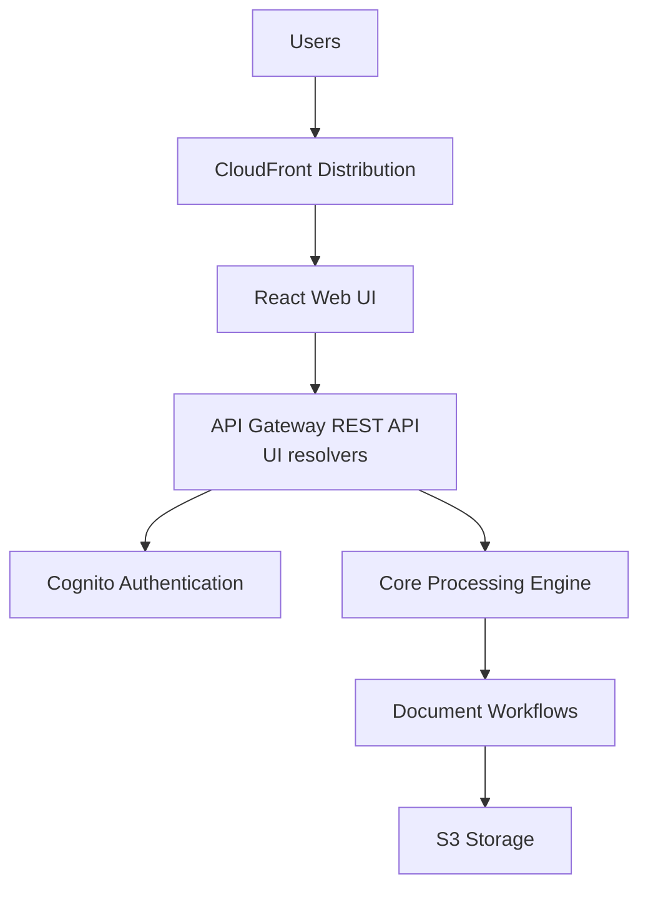
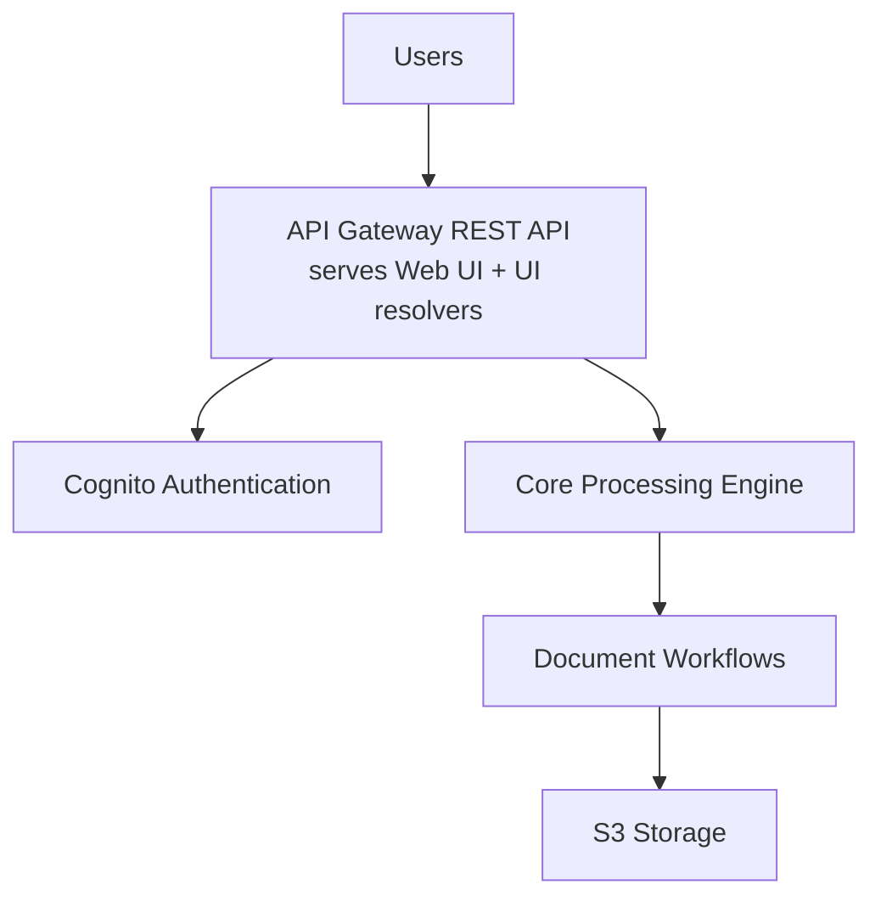
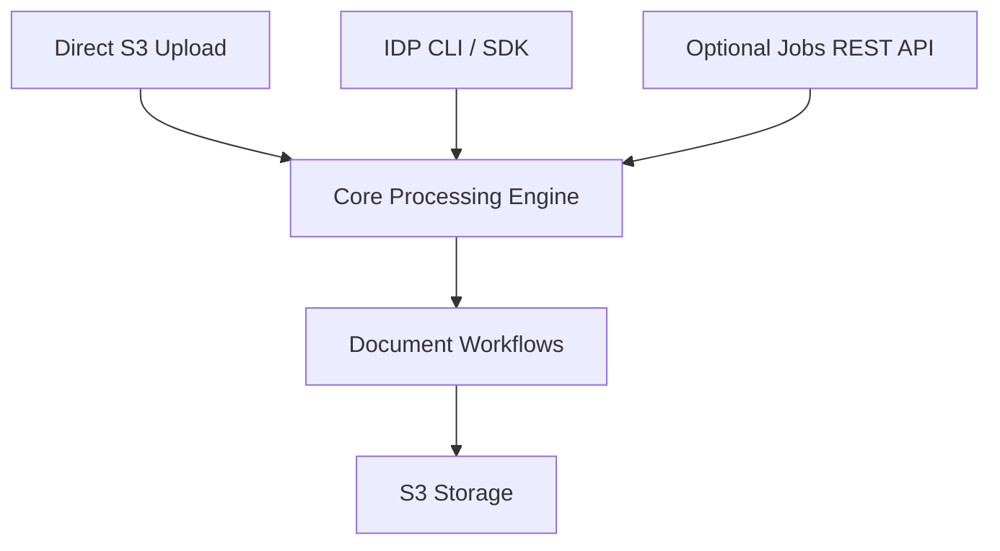

Copyright Amazon.com, Inc. or its affiliates. All Rights Reserved.
SPDX-License-Identifier: MIT-0

# GovCloud Architecture

This document describes the architectural differences between the standard
(commercial AWS) deployment and the two GovCloud deployment variants of the
GenAI IDP Accelerator.

For deployment instructions and how to choose between the variants, see the
[GovCloud Deployment Guide](./govcloud-deployment.md).

## Two GovCloud Variants

GovCloud lacks two services the standard template uses — **Amazon CloudFront**
and **Lambda Function URLs** — so the standard template cannot deploy there.
`idp-cli` provides two mutually exclusive template transforms:

| | **`--govcloud`** (Web UI) | **`--headless`** |
|---|---|---|
| **What is removed** | CloudFront, plus the chat-streaming Function URL and its LWA-based handler | The entire UI and everything that serves it (see below) |
| **Web UI** | ✅ Full React UI, served by API Gateway | ❌ Removed |
| **Authentication** | Cognito (as in commercial) | IAM; optional OAuth2 for the Jobs API |
| **Chat / agents / Test Studio / HITL / knowledge base** | ✅ Retained | ❌ Removed |

> `--headless` is not GovCloud-specific — it works in any region. See the
> [Headless Deployment Guide](./headless-deployment.md).

## Architecture Comparison

### Standard AWS Deployment (commercial)



### GovCloud `--govcloud` (Web UI, no CloudFront)



The same REST API that backs the UI also serves the UI's static assets as an
S3 proxy (`WebUIHosting=APIGateway` — see
[API Gateway Hosting](./apigateway-hosting.md)). Chat works without the
streaming Function URL by falling back to a non-streaming polling path — see
[Chat in GovCloud](./govcloud-deployment.md#chat-in-govcloud-non-streaming).

### GovCloud `--headless`



## What `--govcloud` Removes

Only the two resource families that do not exist in GovCloud:

- **All `AWS::CloudFront::*` resources** (distribution, origin access control,
  security headers policy) and the CloudFront-only parameters/conditions. The
  Web UI is instead served by API Gateway.
- **The `AWS::Lambda::Url` resource and its handler** — the chat *streaming*
  endpoint (`ChatStreamProcessorUrl`) plus `ChatStreamProcessorFunction`, its
  log group, its Lambda permission, and the `ChatStreamInvoke` IAM statement.
  The handler goes too because it layers in the AWS Lambda Web Adapter, which
  is published only in the commercial partition (account `753240598075`); since
  account IDs do not exist across partitions, no `${AWS::Partition}`
  substitution can make that layer ARN resolvable and the stack rolls back on a
  403 `lambda:GetLayerVersion`. The UI auto-detects the absent stream URL and
  polls for chat answers instead; the final answer is identical. The polling
  path is served by the **retained** `AgentChatProcessorFunction` /
  `ChatWithDocumentProcessorFunction` behind the UI REST API, so removing the
  streaming function does not reduce chat functionality — only live token
  streaming.

Everything else — Cognito authentication, the UI REST API, WAF, agents, MCP,
Test Studio, HITL, knowledge base, discovery, configuration UI — is retained
and works as in commercial regions, subject to the capability gaps below.

## GovCloud Capability Gaps (all deploy modes)

These are **not** template transforms. They are partition conditions in the
templates themselves, so they apply equally to `--govcloud`, `--headless` and
the untransformed template — there is nothing to opt into or out of.

### Bedrock Data Automation as the OCR backend

The `bda` OCR backend needs a stack-scoped BDA **SYNC** project whose
`standardOutputConfiguration` carries a `document` block. BDA itself is offered
in `us-gov-west-1`, but that project shape is not: the API rejects it with
`ValidationException: Sync project does not support video/audio/document
modality in Standard Output Configuration`.

`BDAOCRProject` (in the nested unified pattern stack) is therefore gated on
`ShouldCreateBDAOCRProject` — the `aws` partition only. Outside it the project
is not created, `BDA_OCR_PROJECT_ARN` is empty, and the OCR service raises a
clear error *only if* `ocr.backend` is actually set to `bda`. Use
`ocr.backend: textract` — the built-in default; the GovCloud preset sets no
`ocr:` key, so the default applies. See
[the deployment guide](./govcloud-deployment.md#bedrock-data-automation-as-the-ocr-backend).

## What `--headless` Removes

The headless transform strips the following resource groups (matching the
`HeadlessTemplateTransformer` in
`lib/idp_sdk/idp_sdk/_core/template_transform.py`):

### Web UI Hosting

- CloudFront distribution, origin access control, and security headers policy
- Web UI S3 bucket and its CodeBuild build/deploy pipeline

### UI API Layer

- The API Gateway REST API nested stack (`APIRESOLVERSTACK`) hosting the
  dispatcher and all UI resolver Lambdas — including Test Studio, evaluation,
  configuration, and document-query resolvers. (This stack replaced the
  former AWS AppSync GraphQL API, which has been removed from the solution
  entirely.)
- UI-only resolver Lambdas in the main template (capacity planning, version
  check, fine-tuning)
- API Gateway Web UI hosting resources (S3 proxy role, Cognito OAuth callback
  registration)

### Authentication

- Cognito User Pool, Identity Pool, user pool client and domain
- Admin user and group management (Admin, Author, Reviewer, Viewer groups)
- Email domain verification functions
- External Identity Provider (SAML/OIDC) integration

### WAF Security

- WAF WebACL, IP sets, and IP set updater functions

### Agents & MCP

- Agent table, agent request handler and processor functions
- AgentCore Gateway and MCP integration resources (gateway manager, analytics
  Lambda, MCP handler, connector/resource-server clients)
- External MCP agent credentials secret
- Text-to-SQL / analytics query capabilities

### Chat

- Chat-with-document processor and the chat streaming Function URL family
- The Step Functions → UI status publisher (fed real-time document status to
  the web UI)

### HITL (Human-in-the-Loop)

- SageMaker A2I flow definition, human task UI, and private workforce
  configuration
- Users table and user management functions
- Section review workflow resolvers

### Knowledge Base

- Bedrock Knowledge Base nested stack (`DOCUMENTKB`) and query functions

### Discovery & Feature Platform

- Discovery bucket, queues, tracking table, processor functions, blueprint
  optimization, and the multi-doc discovery state machine
- The Feature Platform nested stack (`EnableFeaturePlatform` is forced off)

## Auditing the IAM Statements a Transform Removed

Both transforms delete IAM and S3 bucket policy statements as well as whole
resources. Against the template this repository builds there are three:
`--headless` drops the `LoggingBucket` grant to the CloudFront log-delivery
service principal, and the agent-chat function's
`secretsmanager:GetSecretValue` on `ExternalMCPAgentsSecret` (a secret the
transform removes); `--govcloud` drops the same CloudFront grant, and
`CognitoAuthorizedRole`'s whole `ChatStreamInvoke` inline policy, whose one
statement granted `lambda:InvokeFunction` and `lambda:InvokeFunctionUrl` on the
chat-streaming function that the transform also removes. The whole policy goes
rather than the statement because IAM rejects `Statement: []`.

These deletions are correct and, for the last one, mandatory — a surviving
statement would leave a dangling `Fn::GetAtt` to a removed resource and
CloudFormation would reject the template. What matters is that a deletion here
**cannot fail at deploy time**: a policy with fewer statements is still a valid
policy, so CloudFormation creates the role happily and a statement dropped in
error only surfaces later as an access-denied at runtime, in the partition you
deployed to.

Note what is **not** touched. `CognitoAuthorizedRole`'s `S3` inline policy —
`s3:GetObject`, `s3:GetObjectVersion` and `s3:ListBucket` on the input and output
buckets, plus its KMS statement — survives both transforms unchanged, so a GovCloud
deployment gives the authenticated role exactly the same S3 reach as a commercial one.

So each transform reports every statement it drops, at `INFO`, naming the
resource (for a role's inline policy, `<RoleLogicalId>.<PolicyName>`), the count
and what matched, and ends with a single summary line:

```
INFO: Policy LoggingBucketPolicy: removed 1 statement(s) (CloudFront service principal)
INFO: Policy CognitoAuthorizedRole.ChatStreamInvoke: removed 1 statement(s) (reference to a resource this transform removed)
INFO: Removed 2 policy statement(s) from 2 policy document(s) — LoggingBucketPolicy (1: CloudFront service principal), CognitoAuthorizedRole.ChatStreamInvoke (1: reference to a resource this transform removed)
```

⚠️ These lines are emitted at `INFO` by a logger this package does not configure
for you. `idp-cli` and the headless transformer set that up, so a CLI-driven
transform prints them; a program that instantiates `GovCloudTemplateTransformer`
directly in a fresh interpreter and calls no `logging.basicConfig` prints
**nothing** — not these lines and not the pre-existing `Removed N resources`
ones either, because logging's last-resort handler only passes `WARNING` and
above. Configure logging at `INFO`, or read the records off the instance as
below.

`Removed 0 policy statements` is printed when there was nothing to drop, so
"nothing was removed" and "the transform said nothing" are distinguishable. If
a permission is missing after deploying a transformed template, read these lines
first: they name the role to look at without diffing the two templates by hand.

SDK callers can read the same records without parsing logs — the transformer
exposes them on the instance as `policy_statement_removals`, a list of
`(resource_identifier, reason, removed, narrowed)` records. `narrowed` counts
statements that survived with a shortened principal or resource list, which
changes a role's effective permissions just as a deletion does.

## Core Services Retained

All core document-processing functionality is retained in both variants:

### Document Processing

- ✅ Unified processing workflow with both modes:
  - **Pipeline mode** (Textract OCR + Bedrock classification/extraction) —
    the GovCloud default, via the `lending-package-sample-govcloud`
    configuration preset (pins GovCloud-available Bedrock models)
  - **BDA mode** (`use_bda: true`) — Amazon Bedrock Data Automation is
    available in `us-gov-west-1` (planned for `us-gov-east-1`)
- ✅ Complete pipeline (OCR, Classification, Extraction, Assessment,
  Summarization, Evaluation)
- ✅ Step Functions workflows and Lambda processing
- ✅ Custom prompt Lambda integration

### Storage & Data

- ✅ S3 buckets (Input, Output, Working, Configuration, Logging)
- ✅ DynamoDB tables (Tracking, Configuration, Concurrency)
- ✅ Data encryption with customer-managed KMS keys
- ✅ Lifecycle policies and data retention

### Monitoring & Operations

- ✅ CloudWatch dashboards and metrics
- ✅ CloudWatch alarms and SNS notifications
- ✅ Lambda function logging and tracing
- ✅ Step Functions execution logging

### Integration

- ✅ SQS queues for document processing
- ✅ EventBridge rules for workflow orchestration
- ✅ Post-processing Lambda hooks
- ✅ Evaluation and reporting systems

## Headless Limitations and Workarounds

These apply to `--headless` only — the `--govcloud` variant keeps the full UI.

### ❌ Removed Features

- Web-based user interface and interactive configuration management
- Document status monitoring in the UI
- User authentication and authorization via Cognito
- WAF security rules and IP filtering
- Agent chat, chat with document, and analytics query interfaces
- Human-in-the-loop review workflows
- Document knowledge base

### ✅ Available Workarounds

- Use S3 direct upload, `idp-cli`, the SDK, or the optional
  [Batch Jobs REST API](./govcloud-batch-api.md) instead of the web UI
- Monitor through CloudWatch dashboards and the Step Functions console (see
  [GovCloud Operations](./govcloud-operations.md))
- Manage configuration via `idp-cli deploy --custom-config` or the
  Configuration bucket
- Use IAM (or the Jobs API's OAuth2 client credentials) for authentication
- Access processing results directly from the Output S3 bucket
- Query evaluation/reporting data through Athena directly

## Related Documentation

- [GovCloud Deployment Guide](./govcloud-deployment.md) — prerequisites, deployment options, and deploy commands
- [Batch Jobs REST API](./govcloud-batch-api.md) — API reference, authentication, and bastion tunnel setup
- [GovCloud Operations](./govcloud-operations.md) — monitoring, troubleshooting, and best practices
- [API Gateway Hosting](./apigateway-hosting.md) — how the Web UI is served without CloudFront
- [Headless Deployment Guide](./headless-deployment.md) — headless mode in general (Commercial and GovCloud)
