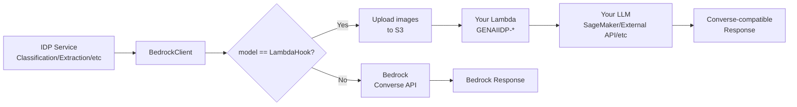

Copyright Amazon.com, Inc. or its affiliates. All Rights Reserved.
SPDX-License-Identifier: MIT-0

# Lambda Hook Inference (Custom LLM Integration)

The GenAI IDP Accelerator supports integrating custom LLM inference endpoints through a **Lambda Hook** mechanism. This allows you to use any LLM — including models hosted on Amazon SageMaker, Amazon ECS, Amazon EC2, or external inference APIs — for any inference step in the document processing pipeline.

## Overview

Instead of calling the Amazon Bedrock Converse API, the accelerator invokes your custom Lambda function with the same Converse API-compatible payload. Your Lambda function processes the request using whatever inference backend you choose and returns a Converse API-compatible response.



## Supported Steps

The LambdaHook option is available for the following pipeline steps in Pattern-1 and Pattern-2:

| Step | Config Field | Description |
|------|-------------|-------------|
| **OCR** (Bedrock backend) | `ocr.model_id` | LLM-based OCR when `backend=bedrock` |
| **Classification** | `classification.model` | Document type classification |
| **Extraction** | `extraction.model` | Structured data extraction |
| **Assessment** | `extraction.confidence.model` | Confidence scoring |
| **Summarization** | `summarization.model` | Document summarization |

## Configuration

### Web UI

1. Navigate to the **Configuration** page
2. Select the step you want to customize (e.g., Extraction)
3. In the **Model** dropdown, select **"LambdaHook"** (first option)
4. Enter your Lambda function ARN in the **Model Lambda Hook ARN** field
5. Save the configuration

### Config YAML

```yaml
extraction:
  model: "LambdaHook"
  model_lambda_hook_arn: "arn:aws:lambda:us-east-1:123456789012:function:GENAIIDP-my-custom-extractor"
  temperature: 0.0
  system_prompt: "You are a document extraction expert..."
  task_prompt: "Extract the following attributes..."
```

### Lambda Function Naming Convention

Your Lambda function name **must start with `GENAIIDP-`**. This naming convention enables secure, scoped IAM permissions — the IDP stack's Lambda functions are granted `lambda:InvokeFunction` permission only for functions matching `GENAIIDP-*`.

**Valid examples:**
- `GENAIIDP-sagemaker-inference`
- `GENAIIDP-api-proxy`
- `GENAIIDP-custom-extraction`

**Invalid examples:**
- `my-custom-function` (missing `GENAIIDP-` prefix)
- `genaiidp-lowercase` (case-sensitive)

## Request Payload

Your Lambda function receives a **Converse API-compatible** payload:

```json
{
  "modelId": "LambdaHook",
  "messages": [
    {
      "role": "user",
      "content": [
        {
          "text": "Extract the following attributes from this Bank Statement document:\n\n..."
        },
        {
          "image": {
            "format": "jpeg",
            "source": {
              "s3Location": {
                "uri": "s3://working-bucket/temp/lambdahook/abc123.jpeg",
                "bucketOwner": "123456789012"
              }
            }
          }
        }
      ]
    }
  ],
  "system": [
    {
      "text": "You are a document extraction expert. Respond only with JSON..."
    }
  ],
  "inferenceConfig": {
    "temperature": 0.0,
    "maxTokens": 10000,
    "topK": 5
  },
  "context": "Extraction"
}
```

### Key Differences from Bedrock Converse API

1. **Images use S3 references** — To avoid the Lambda 6MB payload limit, inline image bytes are automatically uploaded to S3 and replaced with `s3Location` references. Your Lambda needs `s3:GetObject` permission on the working bucket.

2. **`<<CACHEPOINT>>` tags are stripped** — These Bedrock-specific tags are removed from text content before sending to your Lambda.

3. **`context` field is added** — Indicates which pipeline step is calling (OCR, Classification, Extraction, Assessment, Summarization).

## Expected Response

Your Lambda function must return a **Converse API-compatible** response:

```json
{
  "output": {
    "message": {
      "role": "assistant",
      "content": [
        {
          "text": "{\"account_number\": \"12345\", \"balance\": \"$1,250.00\"}"
        }
      ]
    }
  },
  "usage": {
    "inputTokens": 1500,
    "outputTokens": 200,
    "totalTokens": 1700
  }
}
```

### Response Fields

| Field | Required | Description |
|-------|----------|-------------|
| `output.message.role` | Yes | Must be `"assistant"` |
| `output.message.content[0].text` | Yes | The model's response text |
| `usage.inputTokens` | No | Input token count (for cost tracking) |
| `usage.outputTokens` | No | Output token count (for cost tracking) |
| `usage.totalTokens` | No | Total token count |

If `usage` is not provided, zeros will be recorded for metering.

### Optional: structured OCR output (confidence + geometry)

For the **OCR** step, a hook may additionally return a top-level `textractBlocks`
object in **Amazon Textract response format** (a `DocumentMetadata` object plus a
`Blocks` list of `PAGE`/`LINE`/`WORD` blocks with `Confidence` and normalized
`Geometry.BoundingBox`). When present and non-empty, the OCR service persists it as
the page's `rawText.json` and `textConfidence.json` instead of the default "no
confidence data" placeholder, and folds it into the consolidated per-page
`pageData.json` (so the confidence/geometry surfaces in the Web UI page Visual
Editor). This carries real per-line/word OCR confidence into
**Assessment** (the `{OCR_TEXT_CONFIDENCE}` prompt placeholder used for extraction
confidence) and makes bounding-box **geometry** available for UI highlighting — the
same data the native Textract backend produces. Text-only hooks are unaffected
(they still get a text-only `pageData.json`). See the
[consolidated OCR page data](../lib/idp_common_pkg/idp_common/ocr/README.md#consolidated-ocr-page-data-pagedatajson)
docs for the `pageData.json` schema.

`Confidence` and `Geometry` are **independently optional** on every block, so a hook
contributes whatever its backend has. A block with no `Confidence` is reported as
`N/A` in the confidence table (not `0.0`), so a geometry-only backend does not
signal to the assessment model that every line was unreliable — see
**GENAIIDP-cohere-parse-hook**, which has geometry but no confidence.

A hook may also return `usage.pages` (in addition to / instead of token counts) to
enable per-page cost metering. See **GENAIIDP-mistral-ocr-hook** for a worked example.

## Sample Lambda Functions

Ready-to-deploy sample Lambda hook functions are provided in [`samples/lambda-hook-inference/`](../samples/lambda-hook-inference/):

| Sample | Description |
|--------|-------------|
| **GENAIIDP-bedrock-proxy** | Forwards to Bedrock Converse API — use as a starting template for custom hooks with pre/post processing |
| **GENAIIDP-sagemaker-hook** | Calls a SageMaker real-time inference endpoint — shows format conversion between Converse API and SageMaker |
| **GENAIIDP-chandra-ocr-hook** | Calls the [Datalab Chandra OCR 2](https://github.com/datalab-to/chandra) hosted API for high-quality OCR — converts page images to structured Markdown, JSON, or HTML |
| **GENAIIDP-mistral-ocr-hook** | Calls the hosted [Mistral OCR](https://mistral.ai/news/ocr-4/) API for high-quality OCR — returns Markdown **plus per-word confidence and bounding-box geometry** (Textract format) for explainability, with per-page cost metering. Fully serverless |
| **GENAIIDP-cohere-parse-hook** | Calls the hosted [Cohere Parse](https://cohere.com/blog/parse) API for low-cost OCR ($1.50 / 1,000 pages) — converts Cohere's HTML tables to Markdown pipe tables and returns **table/figure bounding boxes**, but **no confidence scores** (Parse provides none). Fully serverless |

Each sample includes:
- Well-commented Python code with clearly marked customization points
- A SAM template (`template.yaml`) for one-click deployment with proper IAM permissions
- S3 image download handling (since images arrive as S3 references)

```bash
# Deploy the samples
cd samples/lambda-hook-inference
sam build && sam deploy --guided --stack-name GENAIIDP-lambda-hooks
```

See the [samples README](../samples/lambda-hook-inference/README.md) for full deployment instructions.

## Chandra OCR Integration

[Chandra OCR 2](https://github.com/datalab-to/chandra) by [Datalab](https://www.datalab.to) is a state-of-the-art VLM-based OCR model that converts images into structured Markdown, JSON, or HTML. It supports 90+ languages, math, tables, forms (including checkboxes), handwriting, and complex layouts.

The **GENAIIDP-chandra-ocr-hook** sample integrates the Datalab hosted API with the LambdaHook feature for OCR. The Datalab API uses an asynchronous pattern:

1. **Submit**: `POST /api/v1/convert` with the page image (multipart form) → returns a `request_check_url`
2. **Poll**: `GET request_check_url` until `status: "complete"` → returns OCR result

### Configuration

```yaml
ocr:
  backend: bedrock
  model_id: "LambdaHook"
  model_lambda_hook_arn: "arn:aws:lambda:us-east-1:123456789012:function:GENAIIDP-chandra-ocr-hook"
```

### Deployment

```bash
cd samples/lambda-hook-inference/GENAIIDP-chandra-ocr-hook
sam build
sam deploy --guided \
  --stack-name GENAIIDP-chandra-ocr-hook \
  --parameter-overrides \
    IDPWorkingBucket=<your-idp-working-bucket-name> \
    CustomerManagedEncryptionKeyArn=<your-kms-key-arn> \
    ChandraApiKey=<your-datalab-api-key>
```

**Getting an API key**: Sign up at [datalab.to](https://www.datalab.to) to get your API key.

### Environment Variables

| Variable | Default | Description |
|----------|---------|-------------|
| `CHANDRA_API_KEY` | (required) | Datalab API key |
| `CHANDRA_API_URL` | `https://www.datalab.to` | Datalab API base URL |
| `OUTPUT_FORMAT` | `markdown` | Output format: `markdown`, `json`, or `html` |
| `CONVERSION_MODE` | `accurate` | Quality mode: `fast`, `balanced`, or `accurate` |
| `POLL_INTERVAL` | `3` | Seconds between polling attempts |
| `MAX_POLL_ATTEMPTS` | `60` | Maximum polling attempts before timeout |

### Local Testing

Test locally before deploying:

```bash
cd samples/lambda-hook-inference/GENAIIDP-chandra-ocr-hook
pip install pdf2image Pillow
export CHANDRA_API_KEY="your-api-key"
python test_local.py ../../insurance_package.pdf --pages 1,2
```

## Mistral OCR Integration

[Mistral OCR 4](https://mistral.ai/news/ocr-4/) is a document-understanding model
that returns markdown-structured text together with paragraph-level bounding boxes,
typed-block classification, and per-page / per-word confidence scores across 170
languages. The **GENAIIDP-mistral-ocr-hook** sample calls the hosted Mistral OCR
API (`POST https://api.mistral.ai/v1/ocr`, Bearer-key auth) — fully serverless, no
SageMaker endpoint or GPU required.

This hook is the reference implementation of the [structured OCR output](#optional-structured-ocr-output-confidence--geometry)
pattern: it requests `include_blocks=true` and `confidence_scores_granularity=word`,
then translates Mistral's response into Amazon Textract block format (normalizing
the pixel bounding boxes against page dimensions to Textract's 0–1 scale) and returns
it under `textractBlocks`. The result: OCR confidence flows into Assessment and bounding-box
geometry is available to the UI, just like the native Textract backend.

### Configuration

```yaml
ocr:
  backend: bedrock
  model_id: "LambdaHook"
  model_lambda_hook_arn: "arn:aws:lambda:us-east-1:123456789012:function:GENAIIDP-mistral-ocr-hook"
```

**Getting an API key**: Sign up at [console.mistral.ai](https://console.mistral.ai) to get your API key, provided as `MistralApiKey` at deploy time.

### Environment Variables

| Variable | Default | Description |
|----------|---------|-------------|
| `MISTRAL_API_KEY` | (required) | Mistral API key (Bearer token) |
| `MISTRAL_API_URL` | `https://api.mistral.ai/v1/ocr` | Mistral OCR endpoint |
| `MISTRAL_OCR_MODEL` | `mistral-ocr-latest` | OCR model id |
| `INCLUDE_BLOCKS` | `true` | Request paragraph bounding boxes (geometry) |
| `CONFIDENCE_GRANULARITY` | `word` | Confidence granularity: `word` or `page` |
| `REQUEST_TIMEOUT` | `120` | Per-request timeout (seconds) |

### Cost metering

The hook returns `usage.pages` (from Mistral's `usage_info.pages_processed`). Add a
pricing entry keyed on the function name (Mistral OCR list price is $4 / 1,000 pages):

```yaml
  - name: GENAIIDP-mistral-ocr-hook
    units:
      - name: pages
        price: "0.004"
```

### Local Testing

```bash
cd samples/lambda-hook-inference/GENAIIDP-mistral-ocr-hook
pip install pdf2image Pillow
export MISTRAL_API_KEY="your-api-key"
python test_local.py ../../insurance_package.pdf --pages 1,2   # markdown + confidence + geometry
python test_translation.py                                     # offline unit tests (no API/AWS)
```

## Cohere Parse Integration

[Cohere Parse](https://cohere.com/blog/parse) (`parse-v5.0`) is a 2.3B-parameter
vision language model that converts document images into Markdown, with tables as
HTML and bounding boxes on tables and figures. The
**GENAIIDP-cohere-parse-hook** sample calls the hosted Parse API
(`POST https://api.cohere.com/v2/parse`, Bearer-key auth) — fully serverless, no
SageMaker endpoint or GPU required. At **$1.50 / 1,000 pages** it is the cheapest
of the OCR hooks (2.7× cheaper than Mistral OCR, the same list price as Textract
`DetectDocumentText`).

### What it does and does not give you

| | Cohere Parse hook | Mistral OCR hook |
|---|---|---|
| OCR confidence | **none** — Parse returns no scores | per LINE and per WORD |
| Geometry | tables and figures only | paragraph-level, all text |
| Tables | HTML → converted to Markdown pipe tables | Markdown |
| Languages | 9 stable, others zero-shot | 170 |
| API accepts | images only (no PDF) | images or PDF |
| List price / page | $0.0015 | $0.004 |

**The confidence gap is the thing to decide on.** With no OCR scores, the
`{OCR_TEXT_CONFIDENCE}` placeholder reports `N/A` per line, so
[Assessment](./extraction-and-confidence.md) cannot ground extraction confidence
in OCR quality — confidence comes from the assessment model alone. Don't tune HITL
thresholds against OCR confidence on this backend. Use the Mistral hook if that
grounding matters to you.

**HTML tables are converted to Markdown by default.** Parse emits tables as HTML;
the accelerator's deterministic table parser (agentic extraction) reads Markdown
pipe tables. Without conversion every table would silently fall back to pure-LLM
extraction and lose the row-completeness guarantee — so the hook converts them
(`CONVERT_HTML_TABLES=false` to opt out). `colspan` is expanded; a nested table is
left as HTML because Markdown cannot represent one.

**Geometry.** The hook requests `output_format=blocks` and attaches each table's
or figure's normalized box to every line derived from it. The OCR service
recognizes a box shared across lines as paragraph-level geometry
(`geometrySource: "paragraph"`), so tables and figures highlight in the Web UI
Visual Editor while body text has no overlay. Parse's pixel `bounding_box` is
ignored — normalizing it would require source-image dimensions the response does
not carry.

### Configuration

```yaml
ocr:
  backend: bedrock
  model_id: "LambdaHook"
  model_lambda_hook_arn: "arn:aws:lambda:us-east-1:123456789012:function:GENAIIDP-cohere-parse-hook"
  # Required when moving an existing config from Textract to any OCR LambdaHook:
  task_prompt: |
    Extract all text from this document image. Preserve the layout, including
    paragraphs, tables, and formatting.
    {DOCUMENT_IMAGE}
```

⚠️ **Switching an existing profile from `backend: textract` needs `{DOCUMENT_IMAGE}`
in `ocr.task_prompt`.** A Textract-based profile has no reason to carry the
placeholder, and config validation rejects the save without it (correctly — the
hook would receive no image). Note that the error message's suggestion to "remove
task_prompt to use system defaults" does **not** resolve it when the stack's
`default` profile is itself Textract-based, because the inherited default has no
placeholder either. Set it explicitly, as above.

**Getting an API key**: Sign up at [dashboard.cohere.com](https://dashboard.cohere.com/api-keys) to get your API key, provided as `CohereApiKey` at deploy time.

### Environment Variables

| Variable | Default | Description |
|----------|---------|-------------|
| `COHERE_API_KEY` | (required) | Cohere API key (Bearer token) |
| `COHERE_API_URL` | `https://api.cohere.com/v2/parse` | Parse endpoint |
| `COHERE_PARSE_MODEL` | `parse-v5.0` | Parse model id |
| `OUTPUT_FORMAT` | `blocks` | `blocks` (table/figure geometry) or `markdown` (no usable geometry) |
| `CONVERT_HTML_TABLES` | `true` | Convert HTML tables to Markdown pipe tables |
| `MAX_RETRIES` | `4` | Retry attempts for 429 / 5xx responses |
| `RETRY_BASE_DELAY` | `1` | Initial backoff in seconds, doubled per attempt |
| `REQUEST_TIMEOUT` | `120` | Per-request timeout (seconds) |

### Service limits and latency

Images only (`document.type: "image_url"`; PDFs are not accepted — fine, since the
accelerator sends page images), 20 MB / 50 megapixels per image, and a flat
**500 requests/minute** for trial *and* production keys, hence the built-in
429/5xx retry with exponential backoff. Trial keys are additionally capped at
1,000 calls/month. Headers, footers and font hierarchy are not identified, and
charts get a description rather than extracted data series.

⚠️ **The hosted API is slow per page.** Measured on a bank statement page:
**~50–90 seconds per page**, and it does not improve with a smaller image (150 dpi
took 55.6s, 300 dpi took 50.9s — the cost is model time, not upload). The blog's
"4.5 pages/second" is a *self-hosted 8×H100 vLLM* figure and does not describe the
hosted API.

Two consequences:

- The pipeline waits up to 900s for a hook (see the LambdaHook read-timeout note
  in the CHANGELOG). Older releases waited only 60s — the boto3 default — and
  would abandon then re-invoke a slow hook, re-running the paid Cohere call while
  the first was still going. If you are on a release before that fix, this hook
  will not complete.
- Cohere Parse's output is not deterministic: repeat calls on the same page
  returned differing block counts and one transcribed an account number
  differently between runs. Don't expect byte-identical OCR across runs.

### Cost metering

The hook returns `usage.pages` (from Parse's `meta.billed_units.pages`).
`config_library/pricing.yaml` ships the entry:

```yaml
  - name: GENAIIDP-cohere-parse-hook
    units:
      - name: pages
        price: "0.0015"
```

### Local Testing

```bash
cd samples/lambda-hook-inference/GENAIIDP-cohere-parse-hook
export COHERE_API_KEY="your-api-key"
python test_local.py ../../old_cal_license.png   # markdown + table/figure geometry
python test_translation.py                       # offline unit tests (no API/AWS)
```

### Self-hosting option

Parse is also offered on **Amazon SageMaker** and Cohere's Model Vault (it is not
on Amazon Bedrock). A SageMaker deployment keeps document images inside your own
account and VPC, and Cohere quotes 23–61% lower cost at sustained GPU
utilization. That is a different hook — start from
[`GENAIIDP-sagemaker-hook`](../samples/lambda-hook-inference/GENAIIDP-sagemaker-hook/)
and reuse this hook's response translation.

## Example Implementations

The following examples show how to build Lambda hooks for various inference providers. For deployable versions, see the samples above.

### SageMaker Endpoint

```python
import json
import boto3

sagemaker_runtime = boto3.client('sagemaker-runtime')
s3_client = boto3.client('s3')

def lambda_handler(event, context):
    """Proxy inference to a SageMaker endpoint."""
    
    # Extract prompts from Converse-compatible payload
    system_text = event['system'][0]['text']
    user_content = event['messages'][0]['content']
    
    # Build prompt for your model
    user_text = ""
    images = []
    for item in user_content:
        if 'text' in item:
            user_text += item['text']
        elif 'image' in item:
            # Download image from S3
            s3_uri = item['image']['source']['s3Location']['uri']
            bucket, key = s3_uri.replace('s3://', '').split('/', 1)
            img_data = s3_client.get_object(Bucket=bucket, Key=key)['Body'].read()
            images.append(img_data)
    
    # Format for your SageMaker model
    payload = {
        "inputs": f"{system_text}\n\n{user_text}",
        "parameters": {
            "temperature": event.get('inferenceConfig', {}).get('temperature', 0.0),
            "max_new_tokens": event.get('inferenceConfig', {}).get('maxTokens', 4096),
        }
    }
    
    response = sagemaker_runtime.invoke_endpoint(
        EndpointName='my-model-endpoint',
        ContentType='application/json',
        Body=json.dumps(payload)
    )
    
    result = json.loads(response['Body'].read())
    
    return {
        "output": {
            "message": {
                "role": "assistant",
                "content": [{"text": result['generated_text']}]
            }
        },
        "usage": {
            "inputTokens": result.get('input_tokens', 0),
            "outputTokens": result.get('output_tokens', 0),
            "totalTokens": result.get('total_tokens', 0),
        }
    }
```

## IAM Permissions

### Your Lambda Function Needs

Your custom Lambda function needs read access to the IDP working bucket (for S3-referenced images):

```json
{
  "Effect": "Allow",
  "Action": ["s3:GetObject"],
  "Resource": "arn:aws:s3:::idp-working-bucket-*/temp/lambdahook/*"
}
```

### IDP Stack Grants

The IDP stack automatically grants its Lambda functions:
- `lambda:InvokeFunction` on `arn:aws:lambda:*:*:function:GENAIIDP-*`
- `s3:PutObject` on the working bucket `temp/lambdahook/` prefix (for image uploads)

## Error Handling

The Lambda Hook includes built-in retry logic:
- **Transient errors** (throttling, timeout): Retried with exponential backoff (same as Bedrock)
- **Function errors**: Retried for unhandled exceptions (cold start issues, etc.)
- **Permanent errors**: Raised immediately (invalid ARN, missing permissions, etc.)

## Metering and Cost Tracking

Lambda Hook invocations are tracked in the document's metering data under:
```
{context}/lambda_hook/{lambda_arn}
```

For example: `Extraction/lambda_hook/arn:aws:lambda:us-east-1:123456789012:function:GENAIIDP-extractor`

Token usage from the Lambda response's `usage` field is included in metering for cost calculations.

## Limitations

1. **Lambda payload limit**: The 6MB synchronous invocation payload limit is mitigated by uploading images to S3, but extremely large text content (>5MB of text alone) may still hit the limit.
2. **Lambda timeout**: Lambda functions have a maximum timeout of 15 minutes. For very large documents, consider chunking.
3. **Cold starts**: Lambda cold starts add latency to the first invocation. Use provisioned concurrency for consistent performance.
4. **No cachePoint support**: Bedrock's prompt caching feature is not available with Lambda hooks.
5. **No guardrails**: Bedrock Guardrails are not applied to Lambda hook invocations.