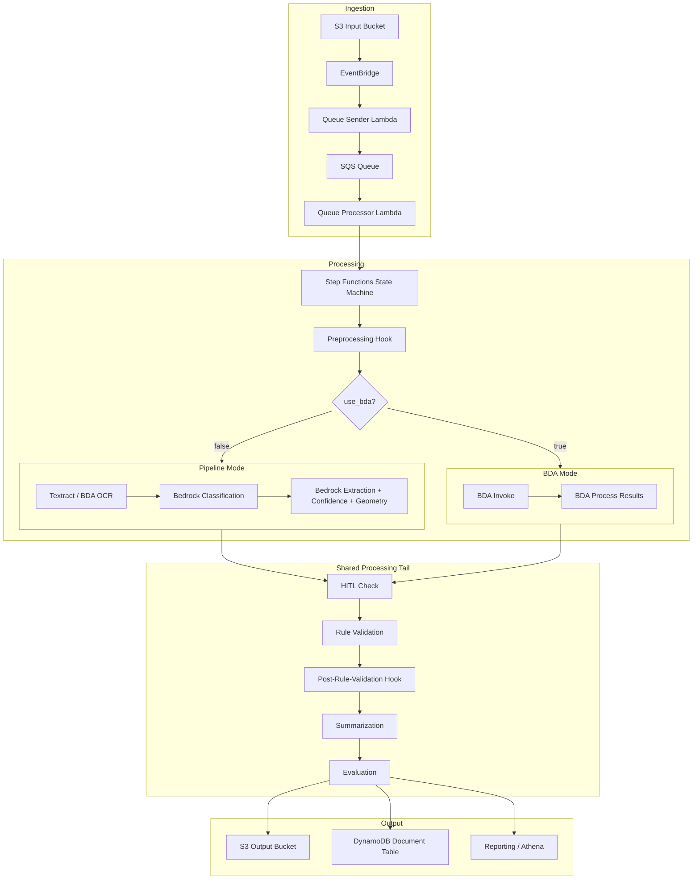
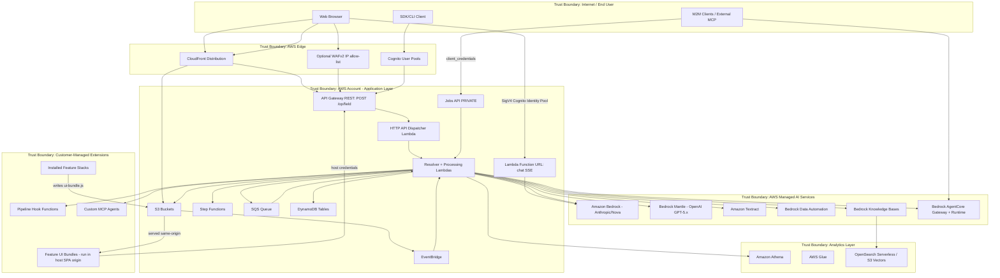

# System Overview

## Document Information

| Field | Value |
|-------|-------|
| **Document Version** | 3.2 |
| **Last Updated** | 2026-09-17 |
| **Applies to release** | v0.6.9 |
| **Classification** | Internal |
| **System Name** | GenAI Intelligent Document Processing (IDP) Accelerator |

> **v3.0 architecture update.** This document was rewritten for the v0.6 line.
> Material changes from v2.0: **AWS AppSync is fully removed** (replaced by an
> API Gateway REST API + polling + a Lambda Function URL for chat streaming);
> **ALB Web UI hosting is removed** (replaced by API Gateway S3-proxy hosting);
> **Amazon A2I / SageMaker HITL is removed** (replaced by a built-in review
> portal in the Web UI); and the **Feature Platform**, **Jobs API**, and
> **preprocessing hook** are new trust-boundary-crossing surfaces.

> **v3.2 refresh (v0.6.9).** The sections below were re-derived from
> `template.yaml`, `nested/api-resolvers/template.yaml`,
> `scripts/api_rbac_expectations.yaml` and the dispatcher / queue-processor
> source rather than edited in place. The main user pool has **five** groups (an
> `Annotator` group scoped by `allowedTestSets`); **119** operations are routable
> through the dispatcher, with the group distribution in §5 taken from
> `scripts/api_rbac_expectations.yaml`; §5 names what each layer does *not* cover,
> including the absence of a default deny at the dispatcher; §5.2 covers the two
> non-REST authenticated entry points and §5.3 admission control; §6 states
> encryption per bucket; §7.1 covers deployment-time privilege. Where a gap's
> fix is in flight it is cited by issue number and marked **pending** — a pending
> fix is not a control, and nothing below should be read as one.

## 1. System Purpose

The GenAI IDP Accelerator is an AWS-deployed intelligent document processing solution that automates the extraction, classification, and analysis of information from documents using generative AI. It provides a configurable, serverless pipeline that processes documents through multiple stages—preprocessing, OCR, classification, extraction (with integrated confidence and bounding-box geometry), rule validation, summarization, and evaluation—with optional human-in-the-loop (HITL) review.

## 2. Unified Architecture

The system uses a **unified deployment model** with two processing modes selectable at runtime via the `use_bda` configuration flag:

- **Pipeline Mode** (`use_bda: false`, default): Uses Amazon Textract (or BDA-as-OCR) for OCR and Amazon Bedrock foundation models (Claude, Nova, OpenAI GPT-5.x via `bedrock-mantle`) for classification, extraction, and confidence.
- **BDA Mode** (`use_bda: true`): Uses Amazon Bedrock Data Automation (BDA) as an integrated service for document processing, with results mapped back into the standard pipeline output format.

Both modes share common infrastructure for document ingestion, preprocessing, queueing, tracking, human review, rule validation, evaluation, reporting, and the web UI.

> **Note on the preprocessing hook.** `preprocessing` runs *first*, before the
> BDA/pipeline routing, so it fires in both modes and even when OCR is
> disabled. It operates on the source document itself and may return
> `halt: true` to end the execution. This is the extension point the bundled
> **PII Anonymization** feature consumes. See HOOK.T06 and PII.T01–T03.

## 3. Key Components

### 3.1 Infrastructure Layer

| Component | Service | Purpose |
|-----------|---------|---------|
| **Input/Output Storage** | Amazon S3 (13 buckets) | Document upload, processing output, configuration, reporting, test sets, evaluation baseline, Web UI assets |
| **Document Queue** | Amazon SQS (17 queues incl. DLQs) | Decouples ingestion from processing; manages throughput |
| **Event Routing** | Amazon EventBridge | S3 events → Lambda, Step Functions status tracking |
| **Workflow Orchestration** | AWS Step Functions (4 state machines) | Multi-step document processing, agentic shard Distributed Map |
| **Document Tracking** | Amazon DynamoDB (12 tables) | Documents, Configuration, Users, Metering, ChatSessions, ChatMessages, Agents, TestSets, etc. |
| **UI API Layer** | **Amazon API Gateway REST** (`POST /op/{field}`) | Single Cognito-authorized route + dispatcher to resolver Lambdas |
| **Chat Streaming** | **AWS Lambda Function URL** (`AuthType=AWS_IAM`, `RESPONSE_STREAM`) | SSE token-delta streaming for the two chat flows |
| **Jobs API** (optional) | Amazon API Gateway REST (PRIVATE) | `EnableJobsApi=true`: `/jobs` endpoints for machine-to-machine batch submission |
| **Edge / WAF** | CloudFront, optional WAFv2 (REGIONAL) | SPA delivery; optional IP allow-list WebACL on the REST API stage |
| **Authentication** | Amazon Cognito (2 user pools + 1 identity pool) | Main user pool (**5 RBAC groups**: Admin, Author, Reviewer, Annotator, Viewer); Identity Pool mints the SigV4 credentials the chat Function URL requires; separate M2M pool for the Jobs API |
| **Encryption keys** | AWS KMS customer-managed key | One stack-owned CMK (`CustomerManagedEncryptionKey`, `EnableKeyRotation: true`) used by 11 of the 13 buckets, the DynamoDB tables, the SQS queues and the CloudWatch log groups |
| **Compute** | AWS Lambda (115+ functions) | Processing logic, API resolvers, agents, hooks |
| **Monitoring** | Amazon CloudWatch | Alarms, dashboards, KMS-encrypted log groups |

### 3.2 AI/ML Services

| Service | Usage |
|---------|-------|
| **Amazon Bedrock** | Foundation models (Claude 3.x–5, Nova) for classification, extraction, confidence, summarization, agent chat |
| **Amazon Bedrock (`bedrock-mantle`)** | OpenAI GPT-5.x (Sol/Terra/Luna) via the OpenAI Responses API — a **non-Anthropic model family** reachable with document content (see PM.T08) |
| **Amazon Bedrock Data Automation (BDA)** | Whole-pipeline processing (`use_bda`) **or** OCR-only engine (`ocr.backend: bda`) |
| **Amazon Textract** | OCR (DetectDocumentText, AnalyzeDocument incl. `TABLES`/`LAYOUT`) |
| **Amazon Bedrock Knowledge Bases** | RAG retrieval over OpenSearch Serverless or S3 Vectors |
| **Amazon Bedrock AgentCore** | MCP Gateway (external tool access) and AgentCore Runtime (e.g. Test Set Generator) |
| **Amazon Athena / Glue** | SQL analytics over processed document data |

### 3.3 Application Features

| Feature | Description | Key Services |
|---------|-------------|--------------|
| **Web UI** | React/Cloudscape SPA for configuration, monitoring, review | CloudFront **or** API Gateway S3 proxy, S3, REST API, Cognito |
| **Agent Analysis** | Multi-agent AI for interactive document analysis | Bedrock, Athena, AgentCore |
| **Companion Chat** | Multi-turn conversational AI with SSE streaming | **Lambda Function URL**, Bedrock, DynamoDB |
| **MCP Integration** | External tool execution via Model Context Protocol | AgentCore Gateway, Lambda, Cognito M2M client |
| **RBAC** | **5-group** role-based access control, plus config-version scope (`allowedConfigVersions`) and test-set scope (`allowedTestSets`) | Cognito Groups, resolver Lambdas |
| **Human Review (HITL)** | **Built-in review portal in the Web UI** (no A2I/SageMaker) | REST API, DynamoDB, S3 |
| **Discovery** | AI-driven configuration generation from sample documents | Bedrock, Lambda, multi-doc-discovery ECR container |
| **SDK/CLI** | Programmatic access for automation and integration | Python packages, Cognito auth |
| **Knowledge Base** | RAG integration for context-enhanced processing | Bedrock KB, OpenSearch Serverless / S3 Vectors |
| **Pipeline Hooks** | `preprocessing` + per-step `postHook` extensibility | Lambda, customer-managed code |
| **Feature Platform / Extensions** | Installable extensions that inject **UI bundles into the host SPA origin** and register their own APIs | S3 (WebUIBucket), CloudFormation, Lambda |
| **PII Anonymization** | Bundled preprocessing extension that redacts PII pre-inference | Bedrock, S3, DynamoDB (mapping table) |
| **Document Versions** | Immutable per-run snapshots with pinned S3 object versions | S3 versioning, DynamoDB |
| **Test Studio** | Test sets, document browser, **ground-truth visual editor** | REST API, Lambda, S3 (TestSetBucket) |
| **Test Set Generator** | Synthetic labeled test-set generation | AgentCore Runtime, Bedrock |
| **Reporting** | Analytics database with Athena, Glue, Parquet | S3, Glue, Athena |
| **Rule Validation** | Configurable business rule checks on extracted data | Lambda, Bedrock |
| **Evaluation** | Automated accuracy measurement against ground truth | Lambda, S3 |
| **Quick Start** | Conversational config bootstrap agent | Bedrock, AgentCore |

## 4. Trust Boundaries

### Trust Boundary Descriptions

| Boundary | Description | Controls |
|----------|-------------|----------|
| **TB1: Internet/End User** | Untrusted external users and clients | TLS 1.2+, authentication required |
| **TB2: AWS Edge** | CDN, identity, optional WAF | CloudFront OAC, Cognito JWT validation, optional WAFv2 IP allow-list (default-block WebACL) |
| **TB3: Application Layer** | Core application infrastructure | IAM roles, least-privilege Lambda execution roles, **all group/scope authorization enforced in resolver Lambdas**, VPC-optional (`ApiGatewayVisibility=PRIVATE`) |
| **TB4: Managed AI Services** | AWS-managed AI/ML services | Service-linked roles, encryption in transit/at rest; note GPT-5.x is a non-Anthropic model family on Bedrock |
| **TB5: Analytics Layer** | Data analytics and search | Athena workgroup isolation, OpenSearch encryption |
| **TB6: Customer Extensions** | Customer/third-party hooks, MCP agents, and **installed features** | Separate IAM roles, invocation-only permissions from core. **Feature UI bundles execute in the host SPA's origin with the user's session** — see FEAT.T01. Hook failure containment is weaker than documented: `onError: fail` is terminal at the `preprocessing` hook point only (HOOK.T07, fix pending in **issue #919**) |
| **TB7: Deployment / IaC** | The principal that creates the stack, and the optional CloudFormation service role shipped for it | CloudTrail attribution, `iam:PassRole` gating, `scripts/sdlc/validate_service_role_permissions.py` in both CI systems. The shipped role is **not** a containment boundary today — see §7.1 and SDK.T05 (narrowing pending in **issue #927**) |

> **Critical boundary note (new in v3.0).** TB6 now contains code that executes
> *inside* TB1's browser context at the host's origin: an installed feature's
> `ui-bundle.js` is injected via `document.createElement('script')` and is
> handed a host API client. Unlike a hook Lambda (which is isolated by IAM),
> a feature UI bundle is **not** isolated from the host session. Installing a
> feature is therefore equivalent to granting it the privileges of every user
> who visits the UI. See [FEAT.T01](../feature-threats/feature-platform.md).
>
> The load mechanism is worth stating precisely, because it determines what a
> control would have to do: the SPA's `FeatureLoader` appends a `<script>` whose
> `src` is `/<feature>/ui-bundle.js` on its own origin, with `crossOrigin`
> set but **no `integrity` attribute**. There is therefore no subresource-integrity
> pin between the bundle written to the Web UI bucket at install time and the
> bundle the browser executes; the controls that apply are the bucket's write
> permissions and the install-time review of the feature, not verification at
> load time.

## 5. Authorization Model (v0.6.9)

### 5.1 The Web UI API edge

Every UI call is a `POST /op/{field}` against a **single** API Gateway REST
route. Because there is one route, there is no per-operation gateway control at
all: the authorization decision lives almost entirely in the code behind the
dispatcher. The "what it does NOT do" column is the load-bearing half of this
table.

| Layer | What it does | What it does NOT do |
|-------|--------------|---------------------|
| WAFv2 (optional) | IP allow-list, default-block WebACL on the REST stage | No authn/authz. Not associated with the chat Function URL |
| API Gateway resource policy | When `ApiGatewayVisibility=PRIVATE`, restricts to the VPC interface endpoint | No user authz |
| Cognito authorizer (`COGNITO_USER_POOLS`) | **Authenticates** the ID token; 401 on missing/invalid/expired | **No group evaluation.** It cannot do per-operation authorization, because every operation shares one route |
| Dispatcher (`http_api_dispatcher`) | Normalizes the event, validates argument shape (400), routes to a resolver Lambda or an in-process handler, maps denials to 403 | **No default deny.** A field it knows how to resolve is forwarded whether or not the target enforces anything (AUTH.T16). Its 403 mapping keys partly on error-message prefixes, so a reworded exception can change an HTTP status. Default-deny and removal of the prefix dependency are pending in **issue #928** |
| In-process handlers (`ddb_direct`, 11 ops) | **Enforces `cognito:groups`** from its own `_REQUIRED_GROUPS` table before touching DynamoDB — the only group check at dispatcher level | Returns without denying for any field absent from that table, so the check is opt-in per field |
| **Resolver Lambda** (~40 functions) | **Enforces `cognito:groups`, `allowedConfigVersions` scope, and per-object ownership** | Nothing forces a check to exist or to be spelled consistently; three hand-written conventions coexist across resolvers |

**119 operations** are routable at v0.6.10 — 40 mapped directly by the
`FIELD_FUNCTION_MAP` published to SSM at
`/${StackName}/http-api/field-function-map`, **69** aliased onto shared
resolvers by `FIELD_ALIASES`, and 11 served in process by `ddb_direct`. Those
three sets sum to 120, not 119, because one field (`getCircuitBreakerStatus`)
appears in both `FIELD_FUNCTION_MAP` and `ddb_direct._HANDLED`; the distinct
union is 119, which is exactly the number of entries in
`scripts/api_rbac_expectations.yaml`. Their required-group distribution:

| Required groups | Ops |
|---|---|
| Admin + Author | 40 |
| Admin only | 21 |
| Any assigned group, whichever one (`ANY_GROUP`) | 18 |
| Admin + Author + Viewer | 15 |
| Any authenticated user, group or no group (`ANY`) | 8 |
| Admin + Annotator + Author | 7 |
| Admin + Annotator + Reviewer | 4 |
| Admin + Reviewer | 2 |
| Admin + Annotator + Author + Viewer | 1 |
| IAM/backend only (Cognito callers rejected) | 2 |

`ANY_GROUP` is resolved at build time into every group `template.yaml` creates, so a
group added there joins those 18 without an edit per operation; what they refuse is a
caller an administrator has not placed in any group, which domain-scoped self-signup
produces. Every document read is in that set, including the ones that return an object
key, an `s3://` URI, a list of extracted attribute names or a model-written page
description rather than a value, because those compose into one chain that was measured
running end to end for a groupless caller. ⚠️ That is a check on the **API**.
`CognitoIdentityPoolSetRole` attaches one `authenticated` role with no `RoleMappings`,
and it grants `s3:GetObject` and `s3:ListBucket` on the document buckets to every
authenticated user irrespective of group, so the **document** bytes are not behind this
distribution (see UI.T06 and AUTH.T03). The two buckets partitioned per user —
Configuration and Test Set — are deliberately not on that role, so the
configuration-revision store and the test-set documents are reachable only through a
resolver that applies the caller's scope to the key.

Beyond the group check, **16** operations verify config-version scope, **4** filter
their result rows by it, and **9** verify per-object ownership.
[`scripts/api_rbac_expectations.yaml`](../../../scripts/api_rbac_expectations.yaml)
is the manifest of record for all of this and is asserted by
`make api-test-static` in both CI systems and by the live matrix in
`make api-test`. It records two accepted gaps. **GAP-02**: the `queryKnowledgeBase`
*resolver* performs no group check of its own, so the dispatcher's floor — which
requires an assigned group — is the only group gate on it. **GAP-07**: the chat
Function URL transport carries no `cognito:groups` claim, so neither chat route's
group check can be applied to callers arriving that way.

Two mechanical details matter when reading resolver code. The REST authorizer
places claims at `requestContext.authorizer.claims` (not where an AppSync-era
resolver would look) and flattens `cognito:groups` into a **comma-joined
string**; `idp_common.api_adapter._coerce_groups` restores it to a list, so that
one function is load-bearing for every group check in the system. And the
CloudFormation logical id of the REST API is `HttpApi` even though its resource
type is `AWS::ApiGateway::RestApi` — a name to read carefully rather than a
second API.

The GraphQL schema (`schema.graphql`) is retained as the source for input-shape
validation and as documentation of intent. Its 213 `@aws_cognito_user_pools`
directives are **advisory only** — nothing enforces them at runtime now that
AppSync is gone (see AUTH.T08).

### 5.2 The two other authenticated entry points

The REST route is not the whole edge. Two further paths authenticate differently
and do **not** inherit the resolver authorization model:

| Entry point | Authentication | Authorization |
|---|---|---|
| **Chat streaming Function URL** (`ChatStreamProcessorUrl`) | `AuthType=AWS_IAM`; the browser SigV4-signs with credentials from the Cognito **Identity Pool** | **No group check.** `lambda:InvokeFunctionUrl` is granted to the single authenticated Identity Pool role that all five groups share, so IAM cannot distinguish them. Ownership of a chat session is not verified on this transport, and the caller identifier available to it is an assumed-role session name rather than a verified Cognito `sub`. See CHAT.T03 and CHAT.T06 — fixes **pending in issue #920** |
| **Jobs API** (optional, `EnableJobsApi=true`) | A separate `ApiUserPool` with OAuth **client-credentials** scopes (`idp-api/jobs.write`, `jobs.read`) | Scope-based, PRIVATE-endpoint only. A distinct realm from the Cognito group model — see JOB.T01–T03 |

When `WebUIHosting=APIGateway`, two further methods (`GET /` and `GET /{proxy+}`)
serve the SPA from S3 with `AuthorizationType: NONE`. That is deliberate: they
serve public static assets, and the WAF plus the endpoint policy are the only
controls that apply to them. Together with the CORS `OPTIONS` method
(`HttpApiOptionsMethod`), which is also `AuthorizationType: NONE`, that makes
**three** unauthenticated methods out of the REST API's four — the fourth,
`POST /op/{field}`, is the only `COGNITO_USER_POOLS` one. All three are
allow-listed explicitly in check **S5** of the static scan, so a *fourth*
unauthenticated method cannot be added without the gate noticing.

CORS is wildcard-origin on both the REST route and the Function URL. Because
credentials travel in headers (bearer token or SigV4) and `AllowCredentials` is
false, this is not itself the authorization gap — but it does mean any origin can
drive both APIs with credentials it can obtain.

### 5.3 Admission control at ingestion

Not authorization, but the same category of control a reader may assume rather
than verify: the queue processor is what stops an upload burst from becoming
unbounded Step Functions and Bedrock spend. Admission is a DynamoDB counter
incremented with `ADD active_count :inc` under a `ConditionExpression` of
`active_count < :max`, so the decision is atomic rather than a read-then-write
race. Around it: `reconcile_counter` corrects drift against the real count of
running executions under its own conditional write; drift is emitted as a metric
so a leaked slot is visible rather than silent; a circuit breaker can stop
admission entirely; SQS visibility is extended during a downstream outage
instead of dropping work; and executions are named deterministically from the
input key and message id, so a redelivered SQS message cannot start a second
execution for the same document. The failure mode worth modelling here is a
*leaked* slot — capacity lost until reconciliation runs — rather than
over-admission. See SDK.T04.

## 6. Data Classification

> **How encryption is actually configured (restated in v3.2).** There is one
> stack-owned KMS customer-managed key, `CustomerManagedEncryptionKey`, with
> `EnableKeyRotation: true`. **11 of the 13 buckets** encrypt with it; the S3
> access-log bucket and the Web UI asset bucket use SSE-S3 (`AES256`) instead,
> which is appropriate — one is a log sink S3 itself writes to, the other holds
> public SPA assets. The DynamoDB tables, the SQS queues and the CloudWatch log
> groups also use the CMK. **All 13 buckets** block public access, enable
> versioning, and carry a bucket policy that denies any request where
> `aws:SecureTransport` is false, so cleartext access is refused at the bucket
> rather than merely discouraged at the client. Two properties of the key policy
> should be modelled rather than assumed: it grants the account root full
> `kms:*`, and it carries **no `kms:ViaService` condition**, so a principal in the
> account that holds the key's data actions can use it directly rather than only
> through the services that hold the data. The key is a stack resource, so its
> deletion is a stack-scoped availability event for everything encrypted under
> it.

| Data Type | Classification | Storage | Encryption |
|-----------|---------------|---------|------------|
| Source documents | Customer Confidential | S3 Input Bucket | SSE-KMS (stack CMK); TLS-only bucket policy |
| Extracted data / results | Customer Confidential | S3 Output Bucket, DynamoDB | SSE-KMS (stack CMK); TLS-only bucket policy; DynamoDB SSE-KMS |
| Document version snapshots | Customer Confidential | S3 (pinned object versions) | SSE-KMS (stack CMK); versioning enabled |
| Configuration | Internal | S3 Config Bucket, DynamoDB | SSE-KMS (stack CMK); DynamoDB SSE-KMS |
| User credentials | Restricted | Cognito | AWS-managed encryption |
| Chat conversations | Customer Confidential | DynamoDB | DynamoDB SSE-KMS (stack CMK) + TTL |
| **PII redaction mappings** | **Restricted** | DynamoDB (feature-owned table) | **SSE with CMK; opt-in storage only** |
| Reporting data | Customer Confidential | S3 Reporting Bucket (Parquet) | SSE-KMS (stack CMK) |
| Test sets + ground truth | Customer Confidential | S3 TestSetBucket | SSE-KMS (stack CMK) |
| Web UI assets (incl. feature `ui-bundle.js`) | Public | S3 WebUIBucket | SSE-S3 (`AES256`) — public by design; the concern here is integrity, not confidentiality (FEAT.T01) |
| S3 access logs | Internal | S3 Logging Bucket | SSE-S3 (`AES256`) — S3 is the writer |
| Knowledge Base vectors | Customer Confidential | OpenSearch Serverless / S3 Vectors | Encryption at rest |
| Processing logs | Internal | CloudWatch Logs | KMS-encrypted log groups |

## 7. Deployment Model

- **Deployment method**: AWS SAM (CloudFormation) via `publish.py` / `idp-cli deploy`
- **Runtime**: Python 3.12+ (Lambda), React/Vite (UI)
- **UI hosting**: `WebUIHosting=CloudFront` (default) or `APIGateway` (S3 proxy on the REST API; VPC-capable, GovCloud-compatible). **ALB hosting removed in v0.6.0.**
- **Regions**: All commercial AWS regions with required service availability; **GovCloud supported** via `idp-cli publish/deploy --govcloud` (full Web UI) or `--headless`
- **Multi-tenancy**: Single-tenant per deployment (one stack = one environment)
- **Infrastructure as Code**: `template.yaml` + nested stacks (`api-resolvers`, `bedrockkb`, `multi-doc-discovery`, feature-platform)

### 7.1 Deployment-time privilege

Deployment is itself a trust boundary (TB7 above), and the most privileged one:
the deploying principal creates the IAM roles, the KMS key and the buckets that
every runtime control in this document depends on. The repository ships an
*optional* CloudFormation **service role**
(`iam-roles/cloudformation-management/`) intended to let an operator deploy
without holding administrator rights. As written it does not achieve that
separation — it holds permissions broad enough to alter the guardrails that
would otherwise bound it, so the ability to pass it is effectively equivalent to
account administrator. Narrowing it is **pending in issue #927**. Until that
merges, treat `iam:PassRole` for that role as an administrative grant and scope
who holds it accordingly. See SDK.T05.

## 8. Security Test Coverage

Four automated test suites back this threat model; results are snapshotted per
release under [`security/test-results/<version>/`](../../test-results/):

| Test | Scope | Threats exercised |
|------|-------|-------------------|
| **SRT** (SAST + deps) | Static analysis, dependency CVEs, IaC | Cross-cutting |
| **ZAP DAST** | Authenticated dynamic scan of the REST API | UI.T01, UI.T03, AUTH.T11 |
| **RBAC static** (`make api-test-static`) | Op↔schema↔expectations drift, missing server-side checks | AUTH.T03, AUTH.T08 |
| **RBAC dynamic** (`make api-test`) | Live multi-role matrix, scope, IDOR, token lifecycle, input validation, TLS | AUTH.T03, T07–T12 |

Two coverage limits are worth stating alongside that table, because a reader can
otherwise take it as broader assurance than it is. Both RBAC suites drive
`POST /op/{field}` only, so **no test exercises the chat Function URL
transport** — a regression on the paths described in §5.2 would not be detected
(CHAT.T03, CHAT.T06). And the static suite asserts each operation against the
expectations manifest; it does not assert that an operation *has* an entry, which
is the AUTH.T16 gap that **issue #928** addresses.

See [`security/README.md`](../../README.md) for how to run each, and
`security/threat-modeling/README.md` for how this corpus is kept current
(`make check-threat-model-currency`).
