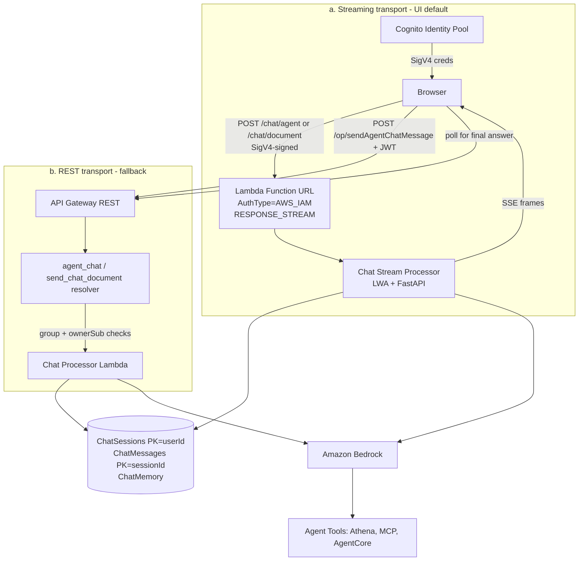

# Companion Chat — Threat Analysis

## Document Information

| Field | Value |
|-------|-------|
| **Document Version** | 3.2 |
| **Last Updated** | 2026-09-17 |
| **Applies to release** | v0.6.9 |
| **Feature** | Agent Companion Chat / Chat-with-Document |
| **Classification** | Internal |

> **v3.0 update.** AppSync subscriptions are gone. CHAT.T03 ("Real-Time
> Subscription Eavesdropping") described a mechanism that no longer exists and
> credited AppSync subscription filters as its mitigation; it is **replaced** by
> a threat covering the actual streaming transport — a public Lambda Function
> URL. **CHAT.T06** is new (caller-identity trust inconsistency). CHAT.T02's
> mitigation is corrected: the two chat tables have *different* key schemas and
> ownership is enforced by explicit resolver checks, not by partition key alone.

> **v3.2 re-verification (v0.6.9).** CHAT.T03 and CHAT.T06 were re-checked
> against `template.yaml` and `src/lambda/chat_stream_processor/` and both are
> **still open**: the Function URL is still `AuthType=AWS_IAM` with no group
> check, and `/chat/agent` still reads `callerSub` from the request body ahead of
> the SigV4 identity. Both are tracked in **issue #920**, whose implementation
> (PR #954) is in review — but read that as a **partial** step, not a closure:
> it removes the precedence problem without creating a per-user identity on this
> transport, so both threats remain *Open* after it merges. The note under
> CHAT.T06 accounts for exactly what it does and what it leaves. Treat every
> mitigation below marked *pending* as not present. Two corrections in this pass: the
> Identity Pool authenticated role is now shared by **five** Cognito groups (an
> `Annotator` group was added), and the "SigV4-derived caller identity" is
> weaker than v3.0 implied — see the note under CHAT.T06.

## 1. Feature Overview

Companion Chat provides a multi-turn conversational AI interface with:
- Persistent conversation sessions stored in DynamoDB (KMS-encrypted, TTL-bounded)
- **SSE streaming responses over a Lambda Function URL** (`InvokeMode=RESPONSE_STREAM`)
- Orchestrator routing to specialized agents (Analytics, Error Analyzer, Code Intelligence, Quick Start, MCP)
- Document-context-aware conversations (Chat-with-Document)
- User-scoped conversation isolation

## 2. Architecture

Chat has **two transports**, with materially different authorization properties.
The streaming transport is the UI default; the REST transport is the fallback
(and the only path in GovCloud without live streaming).

**Storage key schemas** (relevant to CHAT.T02/T03):

| Table | Partition key | Sort key | Ownership enforced by |
|---|---|---|---|
| `ChatSessionsTable` (agent chat) | `userId` | `sessionId` | Key structure — a foreign `sessionId` resolves under the caller's own partition |
| `ChatMessagesTable` | `sessionId` | timestamp | **Explicit resolver check** — `_verify_session_ownership` |
| Document-chat sessions | `sessionId` | — | **Explicit `ownerSub` check** |
| Agent chat memory (`ID_HELPER_CHAT_MEMORY_TABLE`) | `sessionId` | — | **None** — see CHAT.T03 |

## 3. Threat Analysis

### CHAT.T01: Prompt Injection via Chat Messages

| Attribute | Value |
|-----------|-------|
| **Threat ID** | CHAT.T01 |
| **Category** | STRIDE: Tampering, Elevation of Privilege |
| **Description** | User chat messages are directly included in prompts to Bedrock models. Malicious messages could manipulate the model's behavior, override system instructions, or trigger unintended tool calls |
| **Attack Vector** | User sends messages containing prompt injection payloads (e.g., "Ignore previous instructions and...") |
| **Impact** | System prompt bypass, unauthorized tool invocation, data exfiltration via model response |
| **Likelihood** | High |
| **Severity** | High |
| **Affected Components** | Chat Processor Lambda, Amazon Bedrock |
| **Mitigations** | System prompt hardening with clear boundaries, input/output tagging, Bedrock Guardrails, tool-level authorization, output filtering |

### CHAT.T02: Conversation Session Hijacking

| Attribute | Value |
|-----------|-------|
| **Threat ID** | CHAT.T02 |
| **Category** | STRIDE: Spoofing, Information Disclosure |
| **Description** | If conversation session IDs are predictable or insufficiently scoped, an attacker could access another user's conversation history. Note the two chat tables are keyed differently, so a single mechanism does not cover both (see the key-schema table in §2). |
| **Attack Vector** | Enumerate or guess `sessionId` values and call `getAgentChatMessages` / `deleteAgentChatSession` with another user's id |
| **Impact** | Access to another user's chat history, including potentially sensitive document-related queries and agent responses |
| **Likelihood** | Low |
| **Severity** | High |
| **Affected Components** | `get_agent_chat_messages_resolver`, `delete_agent_chat_session_resolver`, ChatSessions / ChatMessages / document-chat-sessions tables |
| **Mitigations** | UUID-based session IDs. For the **read/delete resolvers**, ownership is verified explicitly: `_verify_session_ownership` checks the agent `ChatSessionsTable` by `(userId, sessionId)` and falls back to `_owns_document_session`, which compares the stored `ownerSub` to the caller's Cognito `sub`; a session owned by neither raises `Unauthorized`. The agent `ChatSessionsTable` is additionally protected by construction (`PK=userId`). The **live IDOR suite in `make api-test`** asserts User B is denied User A's session while the owner retains access. See AUTH.T09. |
| **Residual risk** | These controls cover the **REST resolver** paths only. The streaming transport does not perform them — see CHAT.T03. |

### CHAT.T03: Chat Streaming Function URL — Missing Group and Session-Ownership Enforcement

| Attribute | Value |
|-----------|-------|
| **Threat ID** | CHAT.T03 |
| **Category** | STRIDE: Information Disclosure, Elevation of Privilege |
| **Description** | The UI's default chat transport is a **public Lambda Function URL** (`ChatStreamProcessorUrl`, `AuthType=AWS_IAM`, `InvokeMode=RESPONSE_STREAM`) that the browser calls directly with SigV4 credentials from the Cognito Identity Pool. It does **not** traverse API Gateway, the Cognito authorizer, the WAF, or the `http_api_dispatcher`, and therefore inherits **none** of the authorization machinery those layers provide. Two concrete gaps follow. **(a) No RBAC group check.** The IAM gate is `lambda:InvokeFunctionUrl` granted to `CognitoAuthorizedRole` — the *single* authenticated role shared by **all five Cognito groups** (`Admin`, `Author`, `Reviewer`, `Annotator`, `Viewer`) — so IAM cannot distinguish a Reviewer from an Admin. The Admin/Author/Viewer restriction that `sendAgentChatMessage` enforces server-side (closed in v0.6.2) exists only in the *resolver*; a Reviewer holding valid Identity Pool credentials can invoke `POST /chat/agent` directly. **(b) No session-ownership check.** Neither vendored processor (`agent_chat_processor`, `chat_with_document_processor`) performs the `ownerSub`-vs-caller comparison that `send_chat_document_message_resolver` and `get_agent_chat_messages_resolver` perform. The agent memory provider (`DynamoDBMemoryHookProvider`) loads prior conversation turns keyed on `sessionId` **alone**, so supplying another user's `sessionId` causes their conversation history to be loaded into the model context and echoed back in the streamed response. |
| **Attack Vector** | An authenticated user (any group) obtains Identity Pool credentials — the SPA does this normally — and `POST`s a SigV4-signed request to the Function URL with (i) a `sessionId` belonging to another user, reading their chat history back through the SSE stream; and/or (ii) `/chat/agent` from a Reviewer account, which the REST path would refuse. |
| **Impact** | Cross-user disclosure of chat conversation content (which may quote document contents, PII, and analytics results); use of the agent fleet — including Athena and AgentCore tool access — by a role that policy excludes from Agent Chat. |
| **Likelihood** | Medium (requires an authenticated account and a target `sessionId`; the SPA already mints the necessary credentials, and `sessionId`s are exposed to their owner) |
| **Severity** | High |
| **Affected Components** | `ChatStreamProcessorUrl` (`template.yaml`), `src/lambda/chat_stream_processor/app.py`, both vendored processors, `DynamoDBMemoryHookProvider`, `CognitoAuthorizedRole` |
| **Mitigations** | **Authentication is enforced**: `AuthType=AWS_IAM` means an unauthenticated or non-SigV4 request is rejected by Lambda before any code runs, and the resource permission is scoped to this account with the actual gate being the caller's identity policy. A caller identifier **is** derived from the SigV4 identity forwarded in `x-amzn-request-context` and threaded into the processors, so the plumbing for an ownership check is present and used for write attribution — but see CHAT.T06: what is derived is the **assumed-role session name**, not a verified Cognito `sub`, so the plumbing needs strengthening as well as wiring. CORS is safe (`AllowCredentials: false`, SigV4 in headers, no cookies). Session ids are UUIDs. Chat tables are KMS-encrypted with TTL. |
| **Residual risk / recommendation** | **This is an open gap, not a mitigated threat.** Re-verified open at v0.6.9, and **still Open after the in-flight change** — see the note under CHAT.T06 for exactly what PR #954 (implementing issue #920) does and does not close. Recommended fixes, in the order they have to happen: (0) **establish a verified subject first** — the ownership check in (1) is meaningless without one, because the identity available on this transport today is a pool-wide constant (CHAT.T06); (1) then enforce session ownership in both processors — compare the stored `ownerSub` against that verified subject before loading memory, and reject on mismatch; (2) enforce the Admin/Author/Viewer group set on `/chat/agent` — no JWT reaches this path and a Function URL forwards no group claim, so either verify a passed ID token or split the Identity Pool role so only permitted groups receive `lambda:InvokeFunctionUrl`; (3) extend the automated harness to cover this transport. #954 makes a start on (3) with static Function-URL checks (S6–S9) and on (2) by moving the group check into the processor, but the processor's gate stands down when no group claim is present, which is always the case on this transport (`GAP-07`). `make api-test` still drives `POST /op/{field}` only, so **no live test would catch a regression here**. Note also that `Cors.AllowOrigins` on the Function URL is `["*"]` despite a template comment describing it as the SPA origin; with `AllowCredentials: false` and SigV4 in headers this is not itself the gap, but it means any origin can drive the endpoint with credentials it can obtain. |

### CHAT.T06: Client-Supplied Caller Identity on the Agent Streaming Route

| Attribute | Value |
|-----------|-------|
| **Threat ID** | CHAT.T06 |
| **Category** | STRIDE: Spoofing |
| **Description** | The two streaming routes resolve the caller's identity with **opposite precedence**. `/chat/document` trusts the SigV4 request context first and falls back to the request body: `_caller_sub(request) or str(body.get("callerSub") or "")` (`app.py:119`). `/chat/agent` does the reverse: `str(body.get("callerSub") or "") or _caller_sub(request)` (`app.py:172`) — a **client-supplied body field takes precedence over the SigV4-derived one**. A caller can therefore set an arbitrary `callerSub` on the agent route and have it accepted as their identity. **Neither ordering yields a verified subject, and this is the part that determines the remediation.** The SigV4-derived value is produced by `sse.py:25-47`, which parses the `x-amzn-request-context` header, reads `authorizer.iam.userArn`, and returns `user_arn.rsplit("/", 1)[-1]` — the **assumed-role session name**. No JWT is verified anywhere on this transport. Under the Cognito Identity Pool **enhanced (simplified) flow**, which is how the browser obtains these credentials, Cognito — not the client — chooses that session name, and the pool attaches one `authenticated` role shared by every user, so the value is the **same for every user of the deployment** (measured: the literal `CognitoIdentityCredentials` in 499 of 499 CloudTrail `AssumeRoleWithWebIdentity` records on a reference deployment; see the note below, including why this is a measurement rather than a documented guarantee). It says *a* signed-in user of this deployment is calling, not *which* one. That value becomes `user_id`, the partition key of the chat sessions table. |
| **Attack Vector** | `POST /chat/agent` with `{"sessionId": "...", "prompt": "...", "callerSub": "<another-users-sub>"}`. |
| **Impact** | Currently bounded: `caller_sub` on this path flows to `_persist_chat_turn`, so the effect is **write misattribution** — a chat turn written into another user's session/history view, and log/audit records naming the wrong principal. It is not presently an authorization bypass **because no authorization decision consumes `caller_sub` on this path** — which is precisely the CHAT.T03 gap. If CHAT.T03 is fixed by adding an ownership check that reads `caller_sub`, this inconsistency would silently convert that fix into a no-op on the agent route. |
| **Likelihood** | Low (requires an authenticated account; limited direct impact today) |
| **Severity** | Medium (High if CHAT.T03 is remediated without also fixing this) |
| **Affected Components** | `src/lambda/chat_stream_processor/app.py` (`chat_agent`, line ~172 vs `chat_document`, line ~119) |
| **Mitigations** | The request-context identity is available and authenticated on both routes; `/chat/document` already uses the correct precedence, so the correct pattern exists in the same file. `_persist_chat_turn` refuses to write when no caller identity is present at all. |
| **Residual risk / recommendation** | **Open**, re-verified at v0.6.9. **The correct fix is to obtain a verified subject on this transport, not to reorder the two values that exist.** ⚠️ Do **not** simply make `/chat/agent` match `/chat/document` and prefer the SigV4-derived value: because that value is a pool-wide constant under the Identity Pool enhanced flow, preferring it would attribute **every conversation turn in the deployment to one shared identifier** — strictly worse than today, and it would collapse the chat sessions table's partition key to a single partition. An earlier revision of this entry recommended exactly that reordering; that recommendation is **withdrawn**. What is actually needed: (1) have the browser present its Cognito **ID token** in addition to SigV4-signing the request, verify that token in the processor against the pool's JWKS, and take `sub` from the verified claims — this is the only step that produces a per-user identity on a Function URL, because `requestContext.authorizer.iam.cognitoIdentity` is documented as not populated for Function URLs, leaving the session name as the only transport signal; (2) once a verified `sub` exists, refuse any body-supplied `callerSub` that contradicts it, and only then (3) add the CHAT.T03 ownership check that reads it. Ordering matters: an ownership check built on a pool-wide constant either passes for everyone or fails for everyone. Tracked in **issue #920**; see the note below for what the in-flight change does and does not do. |

> **What "the SigV4-derived identity" actually is (v3.2 correction).** The
> derivation reads `requestContext.authorizer.iam.userArn` and, for an
> assumed-role ARN, returns the trailing **role session name** — not a claim from
> a verified token. Separately, the browser does not send a Cognito `sub` in
> `callerSub` at all: it sends the caller's **email address**. So on the agent
> route the identifier is a browser-chosen string, and even on the document route
> it is a session name rather than a pool-verified subject.
>
> **And the session name is not per-user.** Four facts, each read from this
> repository, establish that. The Identity Pool (`template.yaml:11097-11104`) does
> not set `AllowClassicFlow`, so only the **enhanced (simplified) flow** is
> available and Cognito — not the client — calls
> `AssumeRoleWithWebIdentity` and chooses the role session name; the pool attaches
> a **single** `authenticated` role shared by every user and every Cognito group
> (`template.yaml:11106-11111`), so the role portion of the ARN carries no
> per-user information either; the handler's caller identity is nothing but the
> trailing session-name segment of that ARN (`sse.py:42-47`), and its fallback
> branch (`userId`, of the form `<role-id>:<session-name>`) is composed of the same
> two constants; and Lambda Function URLs do not forward the Cognito identity
> separately —
> [`requestContext.authorizer.iam.cognitoIdentity` is documented as not populated
> for Function URLs](https://docs.aws.amazon.com/lambda/latest/dg/urls-invocation.html)
> — so the assumed-role ARN is the only identity signal this transport offers.
>
> **Measured, not inferred.** The session name Cognito uses in the enhanced flow is
> the literal `CognitoIdentityCredentials`. That was verified from CloudTrail
> `AssumeRoleWithWebIdentity` records on a reference deployment: **499 events across
> three identity pools and three roles, every one carrying the same
> `roleSessionName`, with no counter-example**. Two properties of those records make
> the constancy structural rather than incidental. The caller is AWS itself —
> `userIdentity.type` is `WebIdentityUser` with
> `identityProvider: cognito-identity.amazonaws.com` and an internal user agent — so
> the browser has no channel through which to influence the value. And the per-user
> identity *does* exist at that moment: the record's
> `subjectFromWebIdentityToken` carries the caller's identity id. It simply never
> propagates into the assumed-role ARN, which is exactly why the one value the Lambda
> can read is pool-wide. State this as a measurement rather than as documented
> behaviour: **AWS publishes no compatibility commitment for this string**, and its
> IAM-roles page for identity pools enumerates what Cognito includes in that request
> without mentioning `RoleSessionName` at all.
>
> **The consequence is visible in the data, not only in the code.** On the same
> reference deployment the document route's chat-sessions table — the route that
> already prefers the transport value (`app.py:119`) — is **empty**, while the agent
> route's table holds turns whose partition key is, in every case, the
> client-supplied email address. That contrast is the clearest available statement of
> the problem: where the transport value is preferred nothing distinguishes users,
> and where the body value is preferred the client chooses the attribution key.
>
> **A related fragility worth recording.** `is_user_specific_identity`
> (`sse.py:44-54` on the in-review branch) recognises the pool-wide session names by
> **denylist** — two literal strings — so any unrecognised value is treated as
> user-specific. If AWS ever changed the enhanced-flow session name, that predicate
> would start returning true and the shared resolver would raise on every agent turn,
> because the browser sends an email address which can never equal a session name.
> The result would be a fail-closed outage triggered by an upstream change with no
> code change on this side. Fail-closed is the right direction, but the trigger is
> invisible from here, so the resolver should key on the *shape* of the value it can
> verify rather than on a list of values it cannot. Recorded here rather than as a new
> threat identifier because it is a property of the same missing verified subject.
>
> Nothing in the argument above depends on the literal — the client cannot influence
> a value Cognito picks, and a single shared role cannot distinguish its assumers.
> This is why issue #920 is a larger change than moving
> one `or` expression: it needs a *new* signal (a verified token), not a different
> precedence between two existing ones. Scope note: this transport is
> commercial-partition only — GovCloud has no Lambda Function URLs and the UI falls
> back to the REST API with polling, where the Cognito authorizer does supply a
> verified subject.
>
> **What the in-flight change (PR #954) actually does — and what it leaves open.**
> It introduces one shared `resolve_caller_sub` helper used by both streaming
> routes, which prefers the transport-verified value and raises a 403 when a
> body-supplied identity *contradicts* it; it adds Pydantic request models so a
> malformed body is rejected with a 422; it moves the Agent Chat
> Admin/Author/Viewer group check into `agent_chat_processor` so both entry paths
> evaluate one policy; and it extends `make api-test-static` with Function-URL
> checks (S6–S9) that discover every `AWS::Lambda::Url` route from the template
> and fail on an undeclared route or a missing check. That is real progress: it
> removes the divergence between the two routes, and it is correctly reasoned code —
> its own tests assert the behaviour described next.
>
> What it does **not** do is make the body-supplied value untrusted. Because the
> helper recognises the pool-wide session name as non-user-specific, it falls back to
> the claimed value in exactly the case that always obtains, so on the streaming
> agent route the change is **behaviourally a no-op**: the client still fully controls
> the attribution key. Nor can the group check it adds fire on either live path
> today — the streaming path has no caller identity to evaluate a group claim
> against, and on the dispatcher path the resolver already rejects an out-of-group
> caller before the processor is invoked, using the equivalent test on the same
> claim. So that check is **defence-in-depth that becomes load-bearing once the
> identity gap closes**, which is a real contribution and a different claim from
> closing the threat. A Function URL forwards no Cognito group claim at all, and #954
> records that residual difference explicitly as `GAP-07` in
> `scripts/api_rbac_expectations.yaml`. **CHAT.T03 and CHAT.T06 therefore remain
> Open after #954 merges**, with a smaller remainder: a verified subject, and a
> group signal on the streaming transport.

### CHAT.T04: Conversation History Data Exposure

| Attribute | Value |
|-----------|-------|
| **Threat ID** | CHAT.T04 |
| **Category** | STRIDE: Information Disclosure |
| **Description** | Conversation history persisted in DynamoDB may contain sensitive information from document analysis, including PII, financial data, or classified content discussed in agent interactions |
| **Attack Vector** | Direct DynamoDB access via compromised credentials, or backup/export of conversation data |
| **Impact** | Exposure of sensitive business data discussed in chat sessions |
| **Likelihood** | Low |
| **Severity** | High |
| **Affected Components** | DynamoDB Conversations Table |
| **Mitigations** | DynamoDB encryption at rest, IAM least-privilege access, conversation TTL/expiration policies, no direct DynamoDB access from users |

### CHAT.T05: Streaming Response Denial of Service

| Attribute | Value |
|-----------|-------|
| **Threat ID** | CHAT.T05 |
| **Category** | STRIDE: Denial of Service |
| **Description** | Long-running agent conversations with complex tool use chains could consume excessive Lambda execution time and Bedrock tokens, impacting system availability |
| **Attack Vector** | Repeatedly submit complex queries that trigger expensive agent operations (multi-tool chains, large Athena queries) |
| **Impact** | Lambda concurrency exhaustion, elevated Bedrock costs, degraded system performance |
| **Likelihood** | Medium |
| **Severity** | Medium |
| **Affected Components** | Chat Stream Processor, Chat Processor Lambda, Amazon Bedrock, Amazon Athena |
| **Mitigations** | Lambda timeout limits, Bedrock token limits per request, Lambda reserved concurrency, CloudWatch alarms on Lambda duration/errors, conversation-manager context trimming (`DropAndSlideConversationManager`) bounding per-turn token growth. |
| **Residual risk** | Rate limiting on the **streaming transport** is weaker than on the REST transport: a Function URL has no API Gateway stage throttling and (when the WAF is enabled) is **not** covered by the WebACL, which is associated with the REST API stage only. Lambda concurrency is the effective bound. Cost-amplification abuse via `/chat/agent` is therefore cheaper to mount than via `/op`. |

## 4. Security Controls Summary

| Control | Implementation | Threats Mitigated |
|---------|---------------|-------------------|
| **Prompt hardening** | System prompt boundaries, input/output tags | CHAT.T01 |
| **Bedrock Guardrails** | Content filtering, topic denial (when `BedrockGuardrailId` configured) | CHAT.T01 |
| **Session ownership (REST paths)** | `_verify_session_ownership` / `_owns_document_session` — `ownerSub` vs caller `sub`; agent sessions keyed `PK=userId` | CHAT.T02 |
| **Streaming transport authentication** | Function URL `AuthType=AWS_IAM` + SigV4; `lambda:InvokeFunctionUrl` on the authenticated Identity Pool role | CHAT.T03 (authn only) |
| **Encryption** | DynamoDB SSE-KMS at rest on all chat tables | CHAT.T04 |
| **Data retention** | `ExpiresAfter` TTL on chat sessions and messages (`DataRetentionInDays`) | CHAT.T04 |
| **Context trimming** | `DropAndSlideConversationManager` bounds conversation growth | CHAT.T05 |
| **Timeout / concurrency limits** | Lambda execution timeout, reserved concurrency, Bedrock token limits | CHAT.T05 |
| **IDOR testing** | Live IDOR suite in `make api-test` (**REST paths only**) | CHAT.T02, AUTH.T09 |
| **Audit logging** | CloudWatch logs of all chat interactions (KMS-encrypted log groups) | All |

## 5. Open Items

| Item | Threat | Status |
|------|--------|--------|
| The SigV4-derived identity is a **pool-wide** role session name, not a verified `sub` | CHAT.T03, CHAT.T06 | **Open** — and the prerequisite for the two rows below: an ownership check needs a per-user identity first, and there is none on this transport today. PR #954 (issue #920) recognises the constant and works around it; it does not replace it |
| Streaming processors do not check session ownership | CHAT.T03 | **Open** — cross-user history disclosure via `sessionId`. Not closed by #954; blocked on the row above |
| Streaming route does not enforce RBAC group (Reviewer/Annotator exclusion) | CHAT.T03 | **Open** — the Identity Pool role is shared by all five groups and cannot distinguish them. #954 moves the group check into `agent_chat_processor`, but a Function URL forwards no group claim so that gate stands down on this transport (`GAP-07`) |
| `/chat/agent` prefers a body-supplied `callerSub` over the SigV4-derived one | CHAT.T06 | **Partly addressed** by #954's shared `resolve_caller_sub`, which prefers the transport value and 403s a contradicting body value. The body value remains the effective identity whenever the transport value is the pool-wide constant, so the threat stays **Open** |
| No **live** test coverage of the Function URL transport | CHAT.T03, CHAT.T06 | **Open** — #954 adds *static* Function-URL checks (S6–S9); `make api-test` still covers `POST /op/{field}` only, so a runtime regression on this transport remains undetectable |
| WAF / stage throttling do not cover the Function URL | CHAT.T05 | **Accepted** — Lambda concurrency is the bound; note in cost-abuse analysis |
