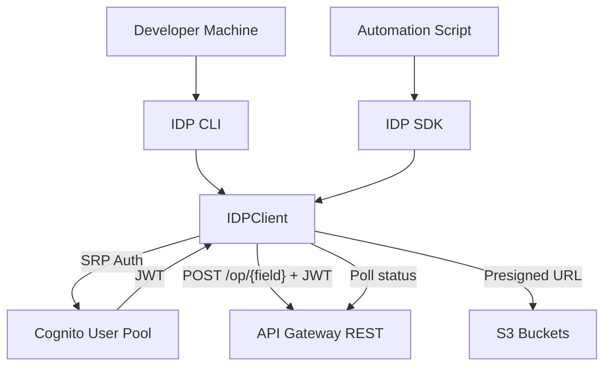

# SDK/CLI — Threat Analysis

## Document Information

| Field | Value |
|-------|-------|
| **Document Version** | 3.2 |
| **Last Updated** | 2026-09-17 |
| **Applies to release** | v0.6.9 |
| **Feature** | IDP SDK & CLI (Programmatic Access) |
| **Classification** | Internal |

## 1. Feature Overview

The IDP SDK and CLI provide programmatic access to the IDP Accelerator for automation, integration, and development workflows:

- **IDP SDK** (`idp_common` package): Python library with `IDPClient` entry point for document processing, configuration management, status monitoring, and evaluation
- **IDP CLI** (`idp_cli` package): Command-line interface wrapping SDK functionality for shell/script usage
- **Authentication**: Cognito-based (username/password → JWT tokens)
- **Communication**: API Gateway REST (`POST /op/{field}`) with a Cognito JWT; S3 presigned URLs for document upload; polling for status
- **Features**: BDA sync mode, discovery, batch processing, configuration management, evaluation

## 2. Architecture

## 3. Threat Analysis

### SDK.T01: Credential Exposure on Developer Machines

| Attribute | Value |
|-----------|-------|
| **Threat ID** | SDK.T01 |
| **Category** | STRIDE: Information Disclosure |
| **Description** | SDK/CLI stores Cognito credentials (username, password) and JWT tokens on local developer machines. These could be exposed through environment variables, config files, shell history, or process memory |
| **Attack Vector** | Credentials stored in plaintext config files, shell history containing passwords, environment variable leakage, or memory dump of running SDK process |
| **Impact** | Unauthorized access to IDP system with victim's permissions |
| **Likelihood** | Medium |
| **Severity** | High |
| **Affected Components** | Developer machines, IDP SDK/CLI |
| **Mitigations** | Encourage environment variable-based credential passing, avoid shell history logging for sensitive commands, short-lived JWT tokens, credential helpers, documentation of secure usage patterns |

### SDK.T02: Insecure Automation Pipelines

| Attribute | Value |
|-----------|-------|
| **Threat ID** | SDK.T02 |
| **Category** | STRIDE: Spoofing, Information Disclosure |
| **Description** | SDK used in CI/CD pipelines or automation scripts may have credentials hardcoded or stored insecurely in pipeline configurations |
| **Attack Vector** | Credentials in CI/CD configuration files, pipeline logs exposing tokens, shared service accounts with excessive permissions |
| **Impact** | Pipeline compromise leads to IDP system access, potentially at Admin level |
| **Likelihood** | Medium |
| **Severity** | High |
| **Affected Components** | CI/CD pipelines, IDP SDK |
| **Mitigations** | Secret management (AWS Secrets Manager, CI/CD secrets), dedicated service accounts with minimal permissions (Reviewer/Viewer for read-only pipelines), credential rotation, pipeline log sanitization |

### SDK.T03: SDK Supply Chain Attack

| Attribute | Value |
|-----------|-------|
| **Threat ID** | SDK.T03 |
| **Category** | STRIDE: Tampering |
| **Description** | The SDK is installed as a Python package. If the package or its dependencies are compromised, malicious code could be introduced |
| **Attack Vector** | Compromised dependency in SDK's dependency chain, or typosquatting attack on package name |
| **Impact** | Arbitrary code execution on developer machines with access to IDP credentials |
| **Likelihood** | Low |
| **Severity** | High |
| **Affected Components** | IDP SDK package, Python package ecosystem |
| **Mitigations** | Pin dependency versions, use dependency scanning tools, package integrity verification, install from trusted sources only |

### SDK.T04: Batch Processing Abuse

| Attribute | Value |
|-----------|-------|
| **Threat ID** | SDK.T04 |
| **Category** | STRIDE: Denial of Service |
| **Description** | SDK enables batch document upload and processing. Malicious or misconfigured batch operations could flood the processing pipeline, exhausting Lambda concurrency, SQS capacity, or Bedrock quotas |
| **Attack Vector** | Script using SDK uploads massive number of documents simultaneously, overwhelming processing capacity |
| **Impact** | Processing pipeline saturation, legitimate document processing delayed or blocked, cost escalation |
| **Likelihood** | Medium |
| **Severity** | Medium |
| **Affected Components** | SQS queue, Step Functions, Lambda concurrency, Bedrock quotas |
| **Mitigations** | Concurrency controls in Queue Processor Lambda, SQS message rate limiting, DynamoDB-based concurrency counter, CloudWatch alarms on queue depth and processing rates, per-user rate limits |

### SDK.T05: Deployment Service Role Is Broad Enough to Reach Account Administrator

| Attribute | Value |
|-----------|-------|
| **Threat ID** | SDK.T05 |
| **Category** | STRIDE: Elevation of Privilege |
| **Description** | The accelerator ships a CloudFormation **service role** (`iam-roles/cloudformation-management/IDP-Cloudformation-Service-Role.yaml`) so that operators can deploy the stack without holding administrator rights themselves. As written it does not achieve that separation. It carries IAM permissions broad enough to modify the guardrails that would otherwise bound it — including `iam:DeleteRolePermissionsBoundary` on `*`, which removes a permissions boundary from any role in the account — alongside wildcard actions on 29 services. Anyone who can pass this role to a CloudFormation stack operation can therefore obtain effective account administrator, so the role is not a least-privilege delegation but an administrator alias with an extra step. The trust policy compounds it: it names the principal without an `ExternalId` or `aws:SourceAccount` condition, so it does not constrain *which* context may assume it. This is a deployment-time control rather than a runtime one, which is why it appears here with the SDK/CLI rather than in the API threats — the CLI's deploy path is its most common consumer. |
| **Attack Vector** | A principal permitted to create or update a stack with this service role passes it, and uses a template to grant itself privileges the role holds — or first strips a permissions boundary that was intended to contain it. No exploitation of a software defect is involved; the permissions as granted allow it. |
| **Impact** | Full administrative control of the deploying AWS account, from a role documented as a scoped deployment role. Any permissions-boundary-based containment strategy in the account is defeated rather than merely bypassed. |
| **Likelihood** | Low (requires an existing principal able to pass the role) |
| **Severity** | Critical |
| **Affected Components** | `iam-roles/cloudformation-management/IDP-Cloudformation-Service-Role.yaml`, `scripts/sdlc/validate_service_role_permissions.py` |
| **Mitigations** | **In place today:** the role is an *optional* artefact — a deployment may use any role or an administrator directly, so its scope is a ceiling on the delegated case rather than a permission the product requires; `scripts/sdlc/validate_service_role_permissions.py` runs in both CI systems and checks the role against the permissions the stack actually needs, so the file is at least under review; the role must be explicitly passed to a stack operation and every use is a CloudTrail event attributable to the passing principal. **Pending — do not read as present:** removing the boundary-manipulation permissions, narrowing the service wildcards to the resources this stack creates, adding a permissions boundary to the role itself, and adding trust-policy conditions, is tracked in **issue #927**. Until that merges, treat granting `iam:PassRole` for this role as equivalent to granting account administrator, and scope who may do so accordingly. |
| **Residual risk / recommendation** | A CloudFormation service role for a stack this broad will always be substantial — it creates IAM roles, KMS keys, buckets and Lambda functions. The realistic goal is that it cannot *escalate beyond* what deploying this stack requires, not that it be small. Document the role's true privilege level plainly wherever it is offered, so an operator does not adopt it believing it to be a containment measure. |

## 4. Security Controls Summary

| Control | Implementation | Threats Mitigated |
|---------|---------------|-------------------|
| **Short-lived tokens** | Cognito access token expiration (1 hour) | SDK.T01 |
| **Secure credential guidance** | Documentation on env vars, secret managers | SDK.T01, SDK.T02 |
| **Minimal permissions** | Per-use-case RBAC roles for SDK users | SDK.T02 |
| **Dependency management** | Pinned versions, scanning | SDK.T03 |
| **Rate limiting** | Concurrency counter, SQS throttling | SDK.T04 |
| **Monitoring** | CloudWatch alarms on processing volume | SDK.T04 |
| **Deployment role review** | `scripts/sdlc/validate_service_role_permissions.py` (both CI systems) checks the shipped CloudFormation service role against the permissions the stack needs | SDK.T05 |
| **Attributable deploys** | The service role must be explicitly passed to a stack operation; CloudTrail records the passing principal | SDK.T05 |
